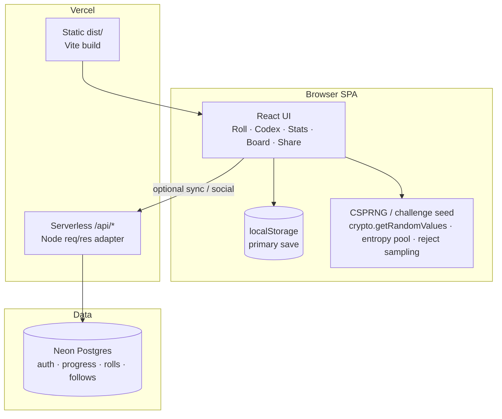

<div align="center">

# 🎲 RNGdle Unlocked

### Unlimited CSPRNG rolls · badges · EP · cloud social — *no 24-hour lock.*

Inspired by the daily number-game genre, but **unlocked**: roll as often as you want, keep a lifetime collection, and optionally sync to Neon for accounts, leaderboards, follows, challenges, and shareable rolls.

**[Live Site](https://rngdle-unlocked.chron0.tech)**

[](https://react.dev)
[](https://www.typescriptlang.org/)
[](https://vitejs.dev)
[](https://pnpm.io)
[](https://vercel.com)
[](https://neon.tech)
[](https://www.better-auth.com)

[Quick start](#-quick-start) · [How it works](#-how-it-works) · [Features](#-features) · [Repo layout](#-whats-in-this-repo) · [Social setup](#-social--cloud-setup) · [Commands](#-commands) · [FAQ](#-faq--troubleshooting)

</div>

---

## 💡 What is this?

**RNGdle Unlocked** is a browser game: roll an integer from **0–1,000,000**, earn **entropy points (EP)** and **badges** from number properties, climb a **journey** of lifetime milestones, and share rolls to Discord.

Unlike a classic daily lock, you can roll **unlimited** times. Progress defaults to **localStorage** on your device. Optional **cloud social** (accounts, username, auto-sync, leaderboard, follows/feed, challenges, attestation seals, vanity share URLs + OG images) runs on **Vercel serverless + Neon Postgres + Better Auth**.

> **Not affiliated with [rngdle.com](https://www.rngdle.com/).** Badge names, scoring, and implementation are original.

| Mode | What you get |
| --- | --- |
| **Solo (default)** | Fortified CSPRNG rolls, badges, EP, history, badge codex, showcase, stats, export/import — offline-capable |
| **Social (opt-in)** | Email sign-up, `@username`, auto cloud sync, “you on the board,” follows + rare-roll feed, public profiles, cloud-gated share links, daily/weekly challenge seeds, optional roll seals, dynamic OG images |

## 📋 Table of contents

- [How it works](#-how-it-works)
- [Quick start](#-quick-start)
- [Features](#-features)
- [What's in this repo](#-whats-in-this-repo)
- [Routes (SPA)](#-routes-spa)
- [Social / cloud setup](#-social--cloud-setup)
- [Commands](#-commands)
- [Environment variables](#-environment-variables)
- [Architecture notes](#-architecture-notes)
- [FAQ / troubleshooting](#-faq--troubleshooting)
- [Status & roadmap](#-status--roadmap)

## 🔭 How it works



**Roll path (free play):** fortified browser CSPRNG → badge evaluation → EP / rarity / percentile → history + collection → localStorage → auto-sync when signed in.

**Challenge path (optional):** on the Roll tab, pick **Daily** or **Weekly**. A shared UTC period seed + your account id yields a **personal, deterministic** number for that period (same inputs always match). Free play stays unlimited CSPRNG whenever you switch back.

**Social path (optional):** Better Auth session → merge-safe sync → public username on leaderboards → follow graph → vanity share links only after cloud confirm → Discord OG HTML + `/api/og` image.

## 🚀 Quick start

### Play only (no backend)

```bash
corepack enable
corepack prepare pnpm@10.34.4 --activate   # or use any pnpm 10.x
pnpm install
pnpm dev
```

Open the URL Vite prints (usually `http://localhost:5173`). Rolls and badges work immediately with no env vars.

### Full stack (auth + leaderboard + sync)

1. Copy env and fill secrets:

```bash
cp .env.example .env.local
```

2. Apply schema to Neon (Drizzle **or** additive script):

```bash
pnpm db:push
# if drizzle-kit asks about truncating rolls, prefer:
node scripts/migrate-feature-wave.mjs
```

3. Run SPA + APIs together (recommended for local social):

```bash
npx vercel dev
```

Or `pnpm dev` for the SPA only and point APIs at a deployed preview.

4. Production: deploy to Vercel, set the same env vars for **Production**, attach Neon, redeploy. Re-run the migration script against prod `DATABASE_URL` if tables/columns are missing.

**Live production:** [https://rngdle-unlocked.chron0.tech](https://rngdle-unlocked.chron0.tech)

## ✨ Features

### Solo playground
- **Unlimited rolls** 0–1,000,000 (no daily lock)
- **Fortified CSPRNG** — `crypto.getRandomValues`, entropy mixing, reject sampling (not `Math.random`)
- **Roll mode picker** — Free play vs Daily vs Weekly with plain-language explanations on the Roll tab
- **140+ badges** across math, patterns, culture, sequences, and more
- **Badge codex** — locked vs unlocked with **spoiler-safe** family hints
- **EP + rarity ladder** (trash → mythic; thresholds retuned for the dense badge catalog so low tiers actually appear) and percentile framing
- **Journey milestones** (lifetime EP)
- **History, showcase, stats** — rarity histogram, EP/hour, 28-day streak calendar
- **Streaks**, optional confetti / SFX
- **Export / import** save files; theme light / dark / system
- **Discord-style share text** + PNG card
- **Readable UI** — larger body/nav type, higher-contrast muted text (light + dark)

### Roll modes (Free / Daily / Weekly)

| Mode | Number source | Notes |
| --- | --- | --- |
| **Free play** | Browser CSPRNG each Generate | Main game; unlimited |
| **Daily** | `hash(daySeed + yourId)` | One personal number per UTC day; re-Generate repeats it |
| **Weekly** | `hash(weekSeed + yourId)` | Same idea for the ISO week |

Switch modes anytime. Badges, EP, history, sync, and share work the same after you have a number.

### Social & competitive
- **Email + password** auth (Better Auth)
- **@username** public identity
- **Auto cloud sync** on every roll when signed in (merge-safe)
- **You on the board** — your rank highlighted + sticky card if outside top list
- **Leaderboard** — all-time / week; sort by EP / rolls / badges
- **Follows + Feed** — follow `@user` from Board (+), Find search, or profile; rare+ public rolls in Board → Feed
- **In-app notifications** — Alerts tab (Activity + System messages); optional browser notifications
- **System messages** — developer broadcasts (`POST /api/system-messages` with `ADMIN_SECRET`)
- **Profiles** — `/u/:username` with Follow button
- **Vanity share URLs** — `/s/:username/:shortCode` (no `/api` in the human path)
- **Share gates** — no public link until cloud confirms; logged-out = account CTA + text only
- **Mythic / anomaly** auto-open share after reveal
- **Prove this roll** — optional server HMAC seal (`/api/attest`). Stamps the claim; does **not** mean free-play RNG was server-side
- **Dynamic OG image** — `/api/og` SVG card for Discord / social crawlers
- **Soft rate limits** on sync and public APIs (fairness, not a 24h lock)

### Planned later
- Discord / GitHub OAuth
- “You got overtaken” notifications
- Turnstile on sign-up
- Server-side EP velocity caps
- Admin wipe / username report
- Fully server-authoritative free-play RNG

## 📁 What's in this repo

```
rngdle-unlocked/
├── api/                 ⚡ Vercel serverless routes (Node adapter → Web Request)
│   ├── auth.ts             Better Auth mount (/api/auth/* via rewrite)
│   ├── health.ts           Smoke test (env presence)
│   ├── me.ts               Session + username
│   ├── sync.ts             Cloud save merge
│   ├── leaderboard.ts      Board + “me” rank
│   ├── follow.ts           Follow / unfollow / list
│   ├── feed.ts             Friends’ rare rolls
│   ├── challenge.ts        Daily + weekly seed payload
│   ├── attest.ts           Optional roll seal
│   ├── og.ts               Dynamic OG image (SVG)
│   ├── profile/[username].ts
│   ├── rolls/[id].ts
│   └── share/[id].ts       OG HTML + image meta for crawlers
├── server/              🧠 Shared API logic
│   ├── auth.ts             betterAuth + Drizzle adapter
│   ├── attest.ts           HMAC seal helpers
│   ├── db/                 Neon + schema (progress, rolls, follows, …)
│   ├── sync.ts             Merge rules + roll upsert
│   ├── rateLimit.ts
│   ├── vercel-adapter.ts   (req, res) ↔ Fetch Request/Response
│   └── logger.ts
├── src/
│   ├── game/               Pure TS engine (rng, badges, challenge, share text)
│   ├── state/              GameProvider + localStorage + waitForCloudPublish
│   ├── lib/                Auth client, sync API, routes, onboarding, logger
│   └── ui/                 Screens + components
├── docs/superpowers/    📚 Specs & plans
├── scripts/             🔧 migrate-feature-wave, check-db, TS7 API patch
├── public/              🖼️ Favicon / PWA icons
├── vercel.json          Rewrites (SPA + auth/share path helpers)
└── package.json         pnpm 10 · React 19 · TS 7 · Vite 6
```

| Area | Role | Stack |
| --- | --- | --- |
| **`src/game/`** | Pure game rules — testable without React | TypeScript |
| **`src/ui/` + `state/`** | SPA experience + persistence | React 19 · Tailwind v4 |
| **`api/` + `server/`** | Social backend on Vercel | Better Auth · Drizzle · Neon |
| **`docs/`** | Design specs and implementation plans | Markdown |

## 🗺️ Routes (SPA)

| Path | Screen |
| --- | --- |
| `/` | Roll (free / daily / weekly) |
| `/history` | History + share |
| `/collection` | Badge **codex** (encyclopedia) |
| `/showcase` | Best rolls & streaks |
| `/stats` | Rarity histogram, EP/hour, calendar |
| `/leaderboard` | Board + Feed + **Find** (username search) |
| `/notifications` | Alerts (Activity + System messages) |
| `/account` | Auth + username + push/pull |
| `/about` | About |
| `/settings` | Theme, effects, export/import |
| `/u/:username` | Public profile (+ follow) |
| `/s/:user/:code` | Vanity public roll (SPA) |
| `/r/:id` | Legacy public roll path |

**API (serverless):**  
`/api/auth/*`, `/api/me`, `/api/sync`, `/api/leaderboard`, `/api/follow`, `/api/feed`, `/api/users/search`, `/api/notifications`, `/api/system-messages`, `/api/challenge`, `/api/attest`, `/api/og`, `/api/profile/:user`, `/api/rolls/:id`, `/api/share/:id`, `/api/health`.

Bot user-agents hitting `/s/:user/:code` are rewritten to `/api/share/:code` for OG HTML + image.

## ☁️ Social / cloud setup

### 1. Neon
- Create a Postgres project (or use Vercel Neon integration).
- Put the **pooled** connection string in `DATABASE_URL` (local + Vercel Production).
- Apply schema:
  - `pnpm db:push`, **or**
  - `node scripts/migrate-feature-wave.mjs` (additive: `short_code`, attestation columns, `follows` — avoids truncate prompts)

Tables include: `user`, `session`, `account`, `verification`, `user_progress`, `rolls`, `follows`, `rate_limits`.

### 2. Better Auth env
| Variable | Local example | Production |
| --- | --- | --- |
| `DATABASE_URL` | Neon pooled URL | **Same real Neon project** you intend to use live |
| `BETTER_AUTH_SECRET` | long random string | same or stronger (also used as attest HMAC key) |
| `BETTER_AUTH_URL` | `http://localhost:5173` | `https://rngdle-unlocked.chron0.tech` (**not** localhost) |
| `VITE_APP_URL` | same as above | production origin |

Generate a secret:

```bash
openssl rand -base64 32
```

### 3. Vercel
- Framework: Vite · build `pnpm run build` · output `dist`
- Set env for **Production** (and Preview if you use it)
- Redeploy after any env change

### 4. Share links (cloud-gated)
Public vanity URLs only work for **rolls that exist in Neon**. Flow:

1. Sign in → set `@username`  
2. Roll (auto-sync) or **Push / merge to cloud**  
3. Share panel waits for cloud → then enables the vanity link  
4. Discord crawlers get OG HTML + `/api/og` image; humans open `/s/user/code`

Logged out: Discord-style text / PNG only — no public URL, with a create-account CTA.

## 🧰 Commands

| Command | Purpose |
| --- | --- |
| `pnpm dev` | Vite dev server (SPA) |
| `pnpm build` | Typecheck app + Vite production build → `dist/` |
| `pnpm typecheck` | App, node, and API tsconfigs |
| `pnpm preview` | Preview `dist/` |
| `pnpm test` | Unit tests (`vp test`) |
| `pnpm lint` | Lint via Vite+ |
| `pnpm db:push` | Push Drizzle schema to Neon |
| `pnpm db:studio` | Drizzle Studio |
| `node scripts/migrate-feature-wave.mjs` | Additive SQL migration (follows, seals, short_code) |
| `npx vercel dev` | Local SPA + serverless APIs |

### Debug logging (browser)

Open DevTools console:

```js
__rngdleLog.setLevel('debug')
__rngdleLog.dump()
```

Server logs use the same `[rngdle:…]` prefixes in Vercel function logs.

## 🔐 Environment variables

See [`.env.example`](./.env.example). Never commit `.env` / `.env.local`.

| Name | Required for | Notes |
| --- | --- | --- |
| `DATABASE_URL` | Social APIs | Neon; must match the project you inspect in the console |
| `BETTER_AUTH_SECRET` | Auth + attest seals | Required in production |
| `BETTER_AUTH_URL` | Auth cookies / CSRF | Production site origin |
| `VITE_APP_URL` | Trusted origins | Usually same as `BETTER_AUTH_URL` |
| `LOG_LEVEL` | Server logs | Optional (`debug` / `info`) |
| `ADMIN_SECRET` | System message broadcasts | Optional; required for `POST /api/system-messages` |

## 🏗️ Architecture notes

- **Game engine is pure TS** under `src/game/` — no React imports; covered by unit tests (including challenge seeds).
- **SPA routing** uses the History API (`src/lib/routes.ts`); Vercel rewrites non-`/api` paths to `index.html`.
- **Serverless handlers** use a small **Node `(req, res)` adapter** (`server/vercel-adapter.ts`) because Vercel’s Node runtime does not pass a Web `Request` by default. The adapter builds an absolute URL (required by Better Auth / better-call).
- **Auth multi-segment paths** (`/api/auth/sign-up/email`) are rewritten to `/api/auth?__path=…` and expanded in the adapter — Vite does not reliably support Next-style `[...all]` catch-alls.
- **TypeScript 7** is native; a postinstall shim re-points `require('typescript')` at `@typescript/typescript6` so Vercel’s classic API typecheck still works.
- **Merge-safe sync** never blindly overwrites: lifetime counters take max, collections union, histories merge by roll id.
- **Share publish** polls `/api/rolls/:key` after auto-sync (`waitForCloudPublish`) before showing a public link.
- **Attestation** is optional HMAC over `(userId, rollId, number, totalEp, rolledAt)` — not a claim of honest client RNG.

## ❓ FAQ / troubleshooting

**Sign-up / APIs 404 or hang on Vercel**  
Confirm latest deploy, Production env vars (especially `BETTER_AUTH_URL` = real domain), and check Function logs. Hit `/api/health` — should return JSON with `ok: true`.

**`Invalid URL` / `headers.get is not a function` in logs**  
Those were fixed by the Node adapter + absolute URL construction. Redeploy if you still see them on an old build.

**Share link doesn’t show / stuck on “Waiting for cloud…”**  
The roll must exist in Neon (`rolls` table). Sign in so auto-sync runs, or Account → Push, then share again. Logged-out users never get a public URL (by design).

**Follow / feed fails**  
Need `follows` table — run `node scripts/migrate-feature-wave.mjs` on that database. Sign in required.

**Leaderboard empty / “you” missing**  
Needs a **username** and **cloud progress**. Set @handle, push, refresh Board.

**Wrong database**  
Compare `DATABASE_URL` host in Vercel with `.env.local`. A Neon project in another region is a different database.

**Session stuck on “Loading…”**  
The Account screen times out after a few seconds and shows the sign-in form. Check `/api/auth/get-session` in Network.

## 📌 Status & roadmap

| Area | Status |
| --- | --- |
| Solo unlimited playground | ✅ Shipped |
| Badges / EP / journey / share card | ✅ Shipped |
| Accounts + auto cloud sync | ✅ Shipped |
| Leaderboards + “you on the board” | ✅ Shipped |
| Profiles + follows + feed | ✅ Shipped |
| Cloud-gated vanity share + mythic auto-share | ✅ Shipped |
| Badge codex + stats page + onboarding tip | ✅ Shipped |
| Daily/weekly challenge + roll attestation | ✅ Shipped |
| Dynamic OG image | ✅ Shipped |
| Readable roll-mode UI + type scale | ✅ Shipped (v0.3) |
| OAuth (Discord/GitHub) | 🔮 Later |
| Notifications / Turnstile / EP velocity / admin | 🔮 Later |
| Server-authoritative free-play rolls | 🔮 Future |

Design docs:

- [Solo design](docs/superpowers/specs/2026-07-08-rngdle-unlocked-design.md)
- [Part 2 social design](docs/superpowers/specs/2026-07-09-mvp-part2-social-design.md)
- [Feature wave plan](docs/superpowers/plans/2026-07-09-feature-wave.md)
- [Implementation plan](docs/superpowers/plans/2026-07-08-rngdle-unlocked.md)

---

<div align="center">

Made for fun · not affiliated with rngdle.com · [Play live](https://rngdle-unlocked.chron0.tech)

</div>
