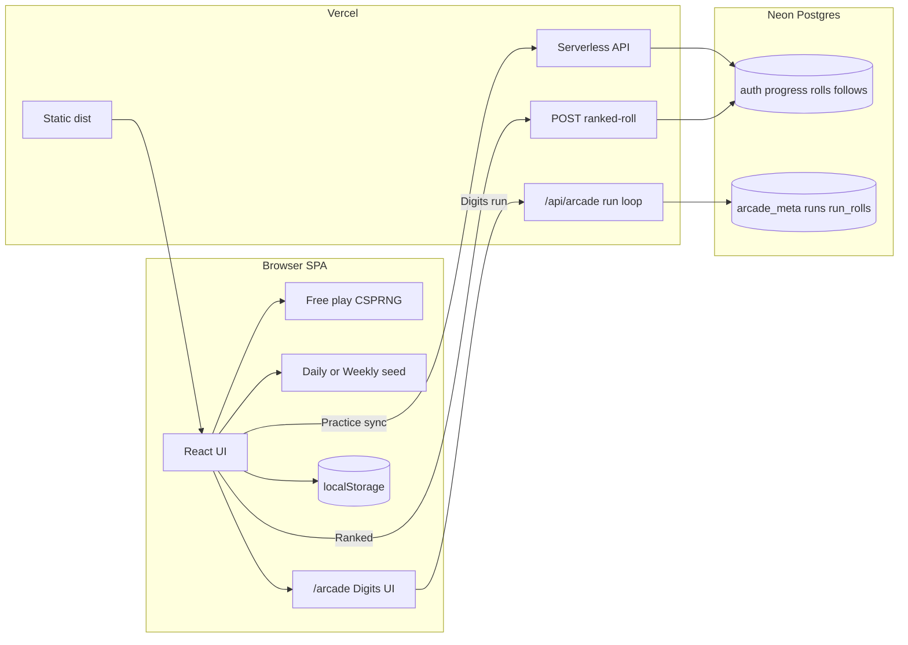

<div align="center">

# 🎲 RNGdle Unlocked

### Unlimited CSPRNG rolls · badges · EP · cloud social — _no 24-hour lock._

Inspired by the daily number-game genre, but **unlocked**: roll as often as you want, keep a lifetime collection, and optionally sync to Neon for accounts, **Ranked + Practice leaderboards**, **Arcade Digits runs**, follows, challenges, and shareable rolls.

**[Live Site](https://rngdle-unlocked.chron0.tech)**

[](https://github.com/jondmarien/rngdle-unlocked/releases/tag/v0.13.0)
[](https://react.dev)
[](https://www.typescriptlang.org/)
[](https://vitejs.dev)
[](https://tanstack.com/query)
[](https://zod.dev)
[](https://pnpm.io)
[](https://vercel.com)
[](https://neon.tech)
[](https://www.better-auth.com)

[Quick start](#-quick-start) · [How it works](#-how-it-works) · [Features](#-features) · [Architecture](./docs/ARCHITECTURE.md) · [Repo layout](#-whats-in-this-repo) · [Social setup](#-social--cloud-setup) · [Commands](#-commands) · [FAQ](#-faq--troubleshooting)

</div>

---

## 💡 What is this?

**RNGdle Unlocked** is a browser game: roll an integer from **0–1,000,000**, earn **entropy points (EP)** and **badges** from number properties, climb **Journey** (roll-count) and **Lifetime EP** milestone seals, and share rolls to Discord.

Unlike a classic daily lock, you can roll **unlimited** times. Progress defaults to **localStorage** on your device. Optional **cloud social** (accounts, username, auto-sync, dual leaderboards, follows/feed, challenges, attestation seals, vanity share URLs + OG images) runs on **Vercel serverless + Neon Postgres + Better Auth**.

> **Not affiliated with [rngdle.com](https://www.rngdle.com/).** Badge names, scoring, and implementation are original.

| Mode                | What you get                                                                                                                                                                                                                                                      |
| ------------------- | ----------------------------------------------------------------------------------------------------------------------------------------------------------------------------------------------------------------------------------------------------------------- |
| **Solo (default)**  | Fortified browser CSPRNG Free play, reel animation, badges, EP, history, codex, showcase, stats, export/import — offline-capable                                                                                                                                  |
| **Social (opt-in)** | Email sign-up, `@username`, auto cloud sync, **Leaderboard → Practice** (synced free play) + **Leaderboard → Ranked** (server free play) + **Arcade** Digits board, community crowns (Ranked only), follows/feed, profiles, alerts, share + OG, challenges, seals |

## 📋 Table of contents

- [How it works](#-how-it-works)
- [Quick start](#-quick-start)
- [Features](#-features)
- [What's in this repo](#-whats-in-this-repo)
- [Routes (SPA)](#-routes-spa)
- [Social / cloud setup](#-social--cloud-setup)
- [Commands](#-commands)
- [Environment variables](#-environment-variables)
- [Architecture notes](#-architecture-notes) · [docs/ARCHITECTURE.md](./docs/ARCHITECTURE.md)
- [FAQ / troubleshooting](#-faq--troubleshooting)
- [Status & roadmap](#-status--roadmap)

## 🔭 How it works



Deeper diagrams (roll lifecycle, Ranked vs Free, Arcade Digits, notifications, OG): **[docs/ARCHITECTURE.md](./docs/ARCHITECTURE.md)**.

**Free play (practice):** fortified browser CSPRNG → badge evaluation → EP / rarity → history + collection → localStorage → auto-sync when signed in → places on **Leaderboard → Practice**. Does **not** claim community crowns.

**Ranked free play (competitive):** sign-in + `@username` → `POST /api/ranked-roll` (server CSPRNG + server score) → `rolls.source = ranked` → places on **Leaderboard → Ranked**, community today/week/all-time crowns, overtake alerts. Client sync cannot forge ranked rows.

**Arcade Mode (Digits runs):** separate tab `/arcade` (not a Home roll mode). Sign-in + `@username` → server-authoritative run loop (`/api/arcade/*`) → Digits, shop upgrades, cash out or bust → **Leaderboard → Arcade** (best Digits run). Digits never convert to EP; Arcade never writes `rolls` / `user_progress`.

**Challenge path (optional):** Roll tab → **Daily** or **Weekly**. Shared UTC period seed + your account id → one personal deterministic number for that period.

**Social path (optional):** Better Auth → merge-safe sync → Ranked / Practice / Arcade boards → follows/feed → vanity share after cloud confirm → OG. Sync may enqueue Activity unlocks; Ranked rolls may enqueue System crown messages.

## 🚀 Quick start

### Play only (no backend)

```bash
corepack enable
corepack prepare pnpm@10.34.4 --activate   # or use any pnpm 10.x
pnpm install
pnpm dev
```

Open the URL Vite prints (usually `http://localhost:5173`). Rolls and badges work immediately with no env vars.

### Full stack (auth + leaderboard + sync)

1. Copy env and fill secrets:

```bash
cp .env.example .env.local
```

2. Apply schema to Neon (Drizzle **or** additive scripts):

```bash
pnpm db:push
# if drizzle-kit asks about truncating rolls, prefer:
node scripts/migrate-feature-wave.mjs
# Arcade Digits tables (additive; safe to re-run):
node --env-file=.env.local scripts/migrate-arcade.mjs
```

3. Run SPA + APIs together (recommended for local social):

```bash
npx vercel dev
```

Or `pnpm dev` for the SPA only and point APIs at a deployed preview.

4. Production: deploy to Vercel, set the same env vars for **Production**, attach Neon, redeploy. Re-run the migration script against prod `DATABASE_URL` if tables/columns are missing.

**Live production:** [https://rngdle-unlocked.chron0.tech](https://rngdle-unlocked.chron0.tech)

## ✨ Features

### Solo playground

- **Unlimited rolls** 0–1,000,000 (no daily lock)
- **Fortified CSPRNG** — `crypto.getRandomValues`, entropy mixing, reject sampling (not `Math.random`)
- **Reel animation** — all digits scramble, then lock with rarity glow; `??? EP` while spinning; badges cascade in; EP counts up
- **Fresh reel on refresh** — home does not restore the last roll; History/Codex keep progress
- **Roll mode picker** — Free play · Ranked · Daily · Weekly with plain-language board placement copy
- **325 number badges** + journey + secret masteries (section seals including Bases / Radix Crown / Atomic Seal, streak secrets, + Codex Absolute)
- **Badge codex** — spoiler-safe locked entries, **unlock timestamps**, **New** tab (first unlocks in the last 5 minutes)
- **NEW ribbons** on first-time unlocks in the roll breakdown
- **Family-colored badge pills** + custom rarity/family icon art
- **Typography** — Outfit (UI), Syne (display), JetBrains Mono (numbers)
- **EP + rarity ladder** (trash → divine) and percentile framing
- **Journey milestones** (lifetime EP)
- **History, showcase, stats** — rarity histogram, EP/hour, 28-day streak calendar
- **Streaks**, optional confetti / SFX
- **Export / import** save files; theme light / dark / system
- **Discord-style share text** + PNG card

### Roll modes

| Mode          | Number source                           | Leaderboard / crowns                                                                    |
| ------------- | --------------------------------------- | --------------------------------------------------------------------------------------- |
| **Free play** | Browser CSPRNG each Generate            | **Practice** board (synced progress). No community crowns.                              |
| **Ranked**    | Server CSPRNG (`POST /api/ranked-roll`) | **Ranked** board + today/week/all-time crowns + overtakes. Needs sign-in + `@username`. |
| **Daily**     | `hash(daySeed + yourId)`                | Challenge number; Free/Ranked stay available.                                           |
| **Weekly**    | `hash(weekSeed + yourId)`               | Same idea for the ISO week.                                                             |
| **Arcade**    | Server CSPRNG inside Digits run loop    | **Arcade** board (best Digits run). Separate tab `/arcade` — Digits ≠ EP.               |

Switch modes anytime (board fully resets). Badges, EP, history, and share work after you have a number. Absolute Ceiling jackpot (1 in 100M) exists on Free and Ranked.

### Social & competitive

- **Email + password** auth (Better Auth)
- **@username** public identity
- **Auto cloud sync** on Free play / challenges when signed in (merge-safe; cannot forge `source=ranked`)
- **Dual EP leaderboard** — **Ranked** (server free play) · **Practice** (synced free play / overall progress); **Total EP** or **Best Roll** (by EP / by rarity); all-time / week; Practice all-time Total EP can sort EP / rolls / badges
- **Arcade Mode** — `/arcade` Digits runs (upgrades, cash out / bust); **Leaderboard → Arcade** ranks best Digits run (never EP)
- **Mode-first Board tabs** — Ranked | Practice | Arcade | Feed | Find
- **Features tab** — signed-in feature requests with upvotes; Active / Shipped / Declined sections; admin status workflow
- **Community highlights** — today’s + weekly best **Ranked** rolls on the home tab when idle (`/api/highlights`)
- **You on the board** — rank highlighted + sticky card if outside top list (per active board)
- **Follows + Feed** — Board (+), Find search, or profile; **all public rarities** (All / Ranked / Free play toggles)
- **In-app notifications** — Activity (follows, unlocks, **overtaken** on Ranked crowns); System (broadcasts + Ranked crown notices); same-roll crown periods grouped into one card
- **System messages** — developer broadcasts (`POST /api/system-messages` + admin session / `api/admin/broadcast`); auto crowns for Ranked day/week/all-time EP #1
- **Profiles** — `/u/:username` with accent, flair, bio, **preset emblem avatars**, secret seals, recent rolls + Follow
- **Vanity share URLs** — `/s/:username/:shortCode`
- **Share gates** — no public link until cloud confirms
- **Mythic / anomaly / divine** auto-open share after reveal (optional setting)
- **Prove this roll** — optional server HMAC seal (`/api/attest`) for claims
- **Dynamic OG** — `/api/og` PNG cards for Discord/social (SVG is not supported by Discord); bot rewrite of `/u/:user` → profile OG HTML
- **Soft rate limits** on sync, Ranked rolls (~90/h), and public APIs
- **Discord / GitHub OAuth** — wired in app; finish portal + env via [`docs/oauth-setup.md`](./docs/oauth-setup.md)

### Planned later / in progress

- Turnstile on sign-up
- Server-side EP velocity caps

## 📁 What's in this repo

```
rngdle-unlocked/
├── api/                 ⚡ Thin Vercel handlers (Node adapter → Web Request)
│   ├── auth.ts · me.ts · sync.ts · health.ts · ranked-roll/ (index + quota)
│   ├── leaderboard.ts · arcade/* · feed.ts · profile/[username].ts · og.ts · …
│   └── admin/* · reports.ts · follow.ts · notifications.ts · …
├── server/              🧠 Shared API logic
│   ├── apiGuards · auth · db/schema · sync · rankedRoll · arcade · rollActivity
│   ├── leaderboard · arcadeLeaderboard · profile · feed · ogSvg · notifications
│   ├── rateLimit · vercel-adapter · ogHtml · …
├── src/
│   ├── game/            Pure TS engine (rng, badges, secrets, challenge, arcade/)
│   ├── state/           GameProvider (contexts) + useSync + settings + localStorage
│   ├── lib/             *-api.ts wrappers (incl. arcade-api), schemas.ts, auth, routes
│   └── ui/              Screens + reel / cascade (+ ArcadeScreen)
├── public/              Avatars, rarity/family icons, secret art, PWA
├── docs/                ARCHITECTURE.md + refactor notes + historical specs
├── scripts/             migrate-arcade, migrate-feature-wave, check-db, TS7 API patch
└── vercel.json          SPA + bot OG rewrites for /s, /u, /arcade, …
```

| Area                     | Role                                              | Stack                                    |
| ------------------------ | ------------------------------------------------- | ---------------------------------------- |
| **`src/game/`**          | Pure game rules — testable without React          | TypeScript                               |
| **`src/ui/` + `state/`** | SPA experience + persistence                      | React 19 · Tailwind v4 · TanStack Query  |
| **`src/lib/*-api.ts`**   | Mandatory client API wrappers (no raw UI `fetch`) | fetch + Zod at trust boundaries          |
| **`api/` + `server/`**   | Social backend on Vercel                          | Better Auth · Drizzle · Neon · apiGuards |
| **`docs/`**              | Living architecture + historical specs/plans      | Markdown                                 |

## 🗺️ Routes (SPA)

| Path             | Screen                                                                       |
| ---------------- | ---------------------------------------------------------------------------- |
| `/`              | Roll (Free / Ranked / Daily / Weekly)                                        |
| `/history`       | History + share                                                              |
| `/collection`    | Badge **codex** (encyclopedia, unlock times, **New** 5‑min tab)              |
| `/showcase`      | Best rolls & streaks                                                         |
| `/stats`         | Rarity histogram, EP/hour, calendar                                          |
| `/leaderboard`   | **Ranked** · **Practice** · **Arcade** · Feed · **Find** (mode-first)        |
| `/arcade`        | Arcade Digits runs (shop, cash out / bust) — sign-in + `@username`           |
| `/features`      | Feature requests (sign-in) — tags, edit, optional screenshot, upvote, status |
| `/notifications` | Alerts (Activity + System)                                                   |
| `/account`       | Auth, username, profile look (avatar/accent/flair/bio), push/pull            |
| `/about`         | How to play, social, fairness                                                |
| `/settings`      | Theme, effects, tips, export/import                                          |
| `/u/:username`   | Public profile (+ follow)                                                    |
| `/s/:user/:code` | Vanity public roll (SPA)                                                     |
| `/r/:id`         | Legacy public roll path                                                      |

**API (serverless):**  
`/api/auth/*`, `/api/me`, `/api/sync`, `/api/ranked-roll` (+ `/quota`), `/api/leaderboard?view=total|best&scope=ranked|practice`, `/api/arcade` (+ `/start` `/roll` `/buy` `/arm` `/cash-out` `/abandon` `/leaderboard`), `/api/feature-requests`, `/api/feature-requests/:id/vote`, `/api/admin/feature-requests`, `/api/highlights`, `/api/follow`, `/api/feed`, `/api/users/search`, `/api/notifications`, `/api/system-messages`, `/api/admin/*`, `/api/reports`, `/api/challenge`, `/api/attest`, `/api/og`, `/api/profile/:user`, `/api/u/:user`, `/api/rolls/:id`, `/api/share/:id`, `/api/health`.

Bot user-agents: `/s/:user/:code` → `/api/share/:code`; `/u/:username` → `/api/u/:username`; `/arcade` → `/api/page/arcade` for OG HTML + image.

## ☁️ Social / cloud setup

### 1. Neon

- Create a Postgres project (or use Vercel Neon integration).
- Put the **pooled** connection string in `DATABASE_URL` (local + Vercel Production).
- Apply schema:
  - `pnpm db:push`, **or**
  - `node scripts/migrate-feature-wave.mjs` (additive: `short_code`, attestation columns, `follows` — avoids truncate prompts)

Tables include: `user` (incl. vanity: accent, bio, flair, avatar), `session`, `account`, `verification`, `user_progress`, `rolls`, `arcade_meta`, `arcade_runs`, `arcade_run_rolls`, `follows`, `notifications`, `system_messages`, `system_message_reads`, `rate_limits`.

Arcade tables: `node --env-file=.env.local scripts/migrate-arcade.mjs`

### 2. Better Auth env

| Variable             | Local example           | Production                                                |
| -------------------- | ----------------------- | --------------------------------------------------------- |
| `DATABASE_URL`       | Neon pooled URL         | **Same real Neon project** you intend to use live         |
| `BETTER_AUTH_SECRET` | long random string      | same or stronger (also used as attest HMAC key)           |
| `BETTER_AUTH_URL`    | `http://localhost:5173` | `https://rngdle-unlocked.chron0.tech` (**not** localhost) |
| `VITE_APP_URL`       | same as above           | production origin                                         |

Generate a secret:

```bash
openssl rand -base64 32
```

### 3. Vercel

- Framework: Vite · build `pnpm run build` · output `dist`
- Set env for **Production** (and Preview if you use it)
- Redeploy after any env change

### 4. Share links (cloud-gated)

Public vanity URLs only work for **rolls that exist in Neon**. Flow:

1. Sign in → set `@username`
2. Roll (auto-sync) or **Push / merge to cloud**
3. Share panel waits for cloud → then enables the vanity link
4. Discord crawlers get OG HTML + `/api/og` image; humans open `/s/user/code`

Logged out: Discord-style text / PNG only — no public URL, with a create-account CTA.

## 🧰 Commands

| Command                                 | Purpose                                               |
| --------------------------------------- | ----------------------------------------------------- |
| `pnpm dev`                              | Vite dev server (SPA)                                 |
| `pnpm build`                            | App + node typecheck, then Vite build → `dist/`       |
| `pnpm typecheck`                        | App, node, and `tsconfig.server.json` (NodeNext)      |
| `pnpm preview`                          | Preview `dist/`                                       |
| `pnpm test`                             | Unit tests (`vp test`)                                |
| `pnpm lint`                             | Lint via Vite+                                        |
| `pnpm db:push`                          | Push Drizzle schema to Neon                           |
| `pnpm db:studio`                        | Drizzle Studio                                        |
| `node scripts/migrate-feature-wave.mjs` | Additive SQL migration (follows, seals, short_code)   |
| `node scripts/migrate-arcade.mjs`       | Additive Arcade tables (`arcade_meta` / runs / rolls) |
| `npx vercel dev`                        | Local SPA + serverless APIs                           |

### Debug logging (browser)

Open DevTools console:

```js
__rngdleLog.setLevel('debug');
__rngdleLog.dump();
```

Server logs use the same `[rngdle:…]` prefixes in Vercel function logs.

## 🔐 Environment variables

See [`.env.example`](./.env.example). Never commit `.env` / `.env.local`.

| Name                 | Required for              | Notes                                                   |
| -------------------- | ------------------------- | ------------------------------------------------------- |
| `DATABASE_URL`       | Social APIs               | Neon; must match the project you inspect in the console |
| `BETTER_AUTH_SECRET` | Auth + attest seals       | Required in production                                  |
| `BETTER_AUTH_URL`    | Auth cookies / CSRF       | Production site origin                                  |
| `VITE_APP_URL`       | Trusted origins           | Usually same as `BETTER_AUTH_URL`                       |
| `LOG_LEVEL`          | Server logs               | Optional (`debug` / `info`)                             |
| `ADMIN_SECRET`       | System message broadcasts | Optional; required for `POST /api/system-messages`      |

## 🏗️ Architecture notes

Full diagrams: **[docs/ARCHITECTURE.md](./docs/ARCHITECTURE.md)**. Refactor summary: **[docs/refactor-notes-2026-07.md](./docs/refactor-notes-2026-07.md)**.

- **Game engine is pure TS** under `src/game/` — no React imports; unit tests cover badges, secrets, challenges, rarity, **Arcade Digits**.
- **SPA routing** uses the History API (`src/lib/routes.ts`); Vercel rewrites non-`/api` paths to `index.html`.
- **Client API wrappers** — UI uses `src/lib/*-api.ts` only (no raw `fetch('/api/...')` in screens). **TanStack Query** caches leaderboard / arcade / feed / highlights / profile / admin-check reads.
- **Zod at trust boundaries** — save import payload, cloud sync POST body, public profile GET response, and Arcade API payloads. Not every endpoint is schema-validated.
- **State** — `GameProvider` exposes `useGame` / `useGameSettings` / `useCloudSync`; sync orchestration in `src/state/useSync.ts`. Arcade run state is server-owned (TanStack Query + `arcade-api`).
- **Serverless handlers** — thin `api/*` → `server/*`; preamble via `server/apiGuards.ts` (`requireUser` / `readJson` / `rateGuard`). Read pipelines live in `server/{leaderboard,arcadeLeaderboard,profile,feed,ogSvg}.ts`.
- **TypeScript** — `tsconfig.server.json` uses **NodeNext** so missing `.js` ESM extensions fail `pnpm typecheck` (prevents Ranked `/var/task` module misses).
- **Auth multi-segment paths** rewritten to `/api/auth?__path=…` (no Next-style catch-all); Node `(req, res)` adapter in `server/vercel-adapter.ts`.
- **Merge-safe sync** — max counters, union collections (earliest `firstEarnedAt`), merge histories by id; integrity gate rejects cloned progress dumps.
- **Ranked rolls** (`POST /api/ranked-roll`, `server/rankedRoll.ts`) — server CSPRNG + score; `rolls.source = ranked`.
- **Leaderboard scopes** — `?scope=ranked|practice` (default ranked); `?view=total|best` (default total); best view uses `?sortBy=ep|rarity`. Arcade Digits board is `GET /api/arcade/leaderboard` (separate from EP).
- **Arcade** (`server/arcade.ts`, `src/game/arcade/`) — Digits economy; server is source of truth; never writes `rolls` / EP; one active run; cash out or bust (DoN loss / abandon).
- **Roll activity** (`server/rollActivity.ts`) — unlock notifications; Ranked-only crowns + overtake alerts.
- **Share publish** polls `/api/rolls/:key` (`waitForCloudPublish`) before enabling vanity links.
- **Attestation** — optional HMAC on a claim (does not prove Free-play client RNG honesty).
- **Session reel** — `lastRoll` is session-only; mode switch fully resets the board.

## ❓ FAQ / troubleshooting

**Sign-up / APIs 404 or hang on Vercel**  
Confirm latest deploy, Production env vars (especially `BETTER_AUTH_URL` = real domain), and check Function logs. Hit `/api/health` — should return JSON with `ok: true`.

**`Invalid URL` / `headers.get is not a function` in logs**  
Those were fixed by the Node adapter + absolute URL construction. Redeploy if you still see them on an old build.

**Share link doesn’t show / stuck on “Waiting for cloud…”**  
The roll must exist in Neon (`rolls` table). Sign in so auto-sync runs, or Account → Push, then share again. Logged-out users never get a public URL (by design).

**Follow / feed fails**  
Need `follows` table — run `node scripts/migrate-feature-wave.mjs` on that database. Sign in required.

**Leaderboard empty / “you” missing**  
Needs a **username**. **Ranked** board: generate via Roll → Ranked. **Practice** board: Free play + sync. **Arcade** board: complete a Digits run on `/arcade`. Toggle boards on the Leaderboard screen (Ranked | Practice | Arcade | Feed | Find).

**Arcade start rejected / “run in progress”**  
One active run per user — Continue or Cash out (or two-step Abandon) from the Arcade tab.

**Ranked roll 500 / “Ranked roll failed”**  
Needs signed-in session + `@username`. Check Vercel function logs for `/api/ranked-roll`. Schema needs `rolls.source` (`node scripts/add-roll-source.mjs`). Extensionless `src/game` imports used to break production while typecheck stayed green — `tsconfig.server.json` **NodeNext** now fails `pnpm typecheck` on that class of bug.

**Arcade 500 / missing tables**  
Run `node --env-file=.env.local scripts/migrate-arcade.mjs` against the same Neon `DATABASE_URL` as production. Confirm `arcade_meta`, `arcade_runs`, `arcade_run_rolls` exist.

**Wrong database**  
Compare `DATABASE_URL` host in Vercel with `.env.local`. A Neon project in another region is a different database.

**Session stuck on “Loading…”**  
The Account screen times out after a few seconds and shows the sign-in form. Check `/api/auth/get-session` in Network.

## 📌 Status & roadmap

| Area                                                                      | Status                                                                            |
| ------------------------------------------------------------------------- | --------------------------------------------------------------------------------- |
| Solo unlimited playground                                                 | ✅ Shipped                                                                        |
| Reel / cascade / EP count-up UX                                           | ✅ Shipped                                                                        |
| Badges / EP / journey / secrets                                           | ✅ Shipped                                                                        |
| Codex unlock times + 5‑min New tab                                        | ✅ Shipped                                                                        |
| Accounts + auto cloud sync                                                | ✅ Shipped                                                                        |
| Community today/week bests (Ranked)                                       | ✅ Shipped                                                                        |
| Dual leaderboards (Ranked + Practice) + follows + feed                    | ✅ Shipped                                                                        |
| Best Roll board (EP / rarity) + Features tab                              | ✅ Shipped (`v0.6.0`)                                                             |
| Arcade Mode (Digits runs) + mode-first Board tabs                         | ✅ Shipped (`v0.7.0`)                                                             |
| Alerts hierarchy + crown grouping; Features status sections               | ✅ Shipped (`v0.7.1`)                                                             |
| Ranked quota indicator (remaining + window reset)                         | ✅ Shipped (`v0.7.2`)                                                             |
| Journey badge artwork (Collection + Profile section)                      | ✅ Shipped (`v0.7.3`)                                                             |
| Codex search (spoiler-safe badge filter)                                  | ✅ Shipped (`v0.7.4`)                                                             |
| Gap remediation (onboarding, Retry, a11y, shared roll rows, admin/trust)  | ✅ Shipped (`v0.8.0`)                                                             |
| Checklist detection + challenge reset countdown + sync integrity          | ✅ Shipped (`v0.8.1`)                                                             |
| Divine rarity + poker hand fixes + badge equation proofs                  | ✅ Shipped (`v0.9.0`)                                                             |
| Bases family, cat/Ultimeme, streak secrets, The Worst, equation proofs v3 | ✅ Shipped (`v0.10.0`)                                                            |
| Profile journey collapse + Secret badges; streak unlock art fix           | ✅ Shipped (`v0.10.1`)                                                            |
| Friends board filter + `/friends` tab                                     | ✅ Shipped (`v0.10.2`)                                                            |
| Delta cloud sync + OG PNG fix + sync quota stopgap                        | ✅ Shipped (`v0.11.0`)                                                            |
| Share seals toggle + Features tags/edit/screenshots + UI polish           | ✅ Shipped (`v0.11.1`)                                                            |
| Lifetime EP badges + abbreviate large numbers setting                     | ✅ Shipped (`v0.12.0`)                                                            |
| Ranked all-time Home crown tile + Ranked · crown labels                   | ✅ Shipped (`v0.12.1`)                                                            |
| Collapsible How to roll (compact mode switch when collapsed)              | ✅ Shipped (`v0.12.2`)                                                            |
| Years family + site accent + Arcade ×N + sync/View As backlog             | ✅ Shipped (`v0.13.0`)                                                            |
| Server Ranked free play (`/api/ranked-roll`)                              | ✅ Shipped                                                                        |
| Profiles (vanity + avatars) + follows                                     | ✅ Shipped                                                                        |
| Activity unlocks + Ranked crown msgs + overtake notifs                    | ✅ Shipped                                                                        |
| Cloud-gated vanity share + OG (rolls + profiles)                          | ✅ Shipped                                                                        |
| Daily/weekly challenge + attestation                                      | ✅ Shipped                                                                        |
| Custom fonts + rarity/family icon art                                     | ✅ Shipped                                                                        |
| OAuth (Discord/GitHub)                                                    | ✅ Wired — finish portal setup via [`docs/oauth-setup.md`](./docs/oauth-setup.md) |
| Email verification + magic link (Resend)                                  | ✅ New signups must verify; OAuth preferred                                       |
| Cloned-progress profile pills + sync integrity                            | ✅ Best-roll ownership + EP/collection checks                                     |
| Turnstile / EP velocity                                                   | 🔮 Later                                                                          |
| Admin panel (role-gated)                                                  | ✅ Shipped (`/admin`)                                                             |
| Architecture refactor (NodeNext, apiGuards, lib wrappers, Zod, useSync)   | ✅ Landed on `main` — see [refactor notes](docs/refactor-notes-2026-07.md)        |

Design docs:

- [**Architecture (mermaid)**](docs/ARCHITECTURE.md)
- [**Refactor notes (July 2026)**](docs/refactor-notes-2026-07.md)
- [Arcade Mode design](docs/superpowers/specs/2026-07-09-arcade-mode-design.md)
- [Solo design](docs/superpowers/specs/2026-07-08-rngdle-unlocked-design.md) _(historical)_
- [Part 2 social design](docs/superpowers/specs/2026-07-09-mvp-part2-social-design.md) _(historical)_
- [Feature wave plan](docs/superpowers/plans/2026-07-09-feature-wave.md) _(historical)_
- [Implementation plan](docs/superpowers/plans/2026-07-08-rngdle-unlocked.md) _(historical)_

---

<div align="center">

Made for fun · not affiliated with rngdle.com · [Play live](https://rngdle-unlocked.chron0.tech)

</div>
