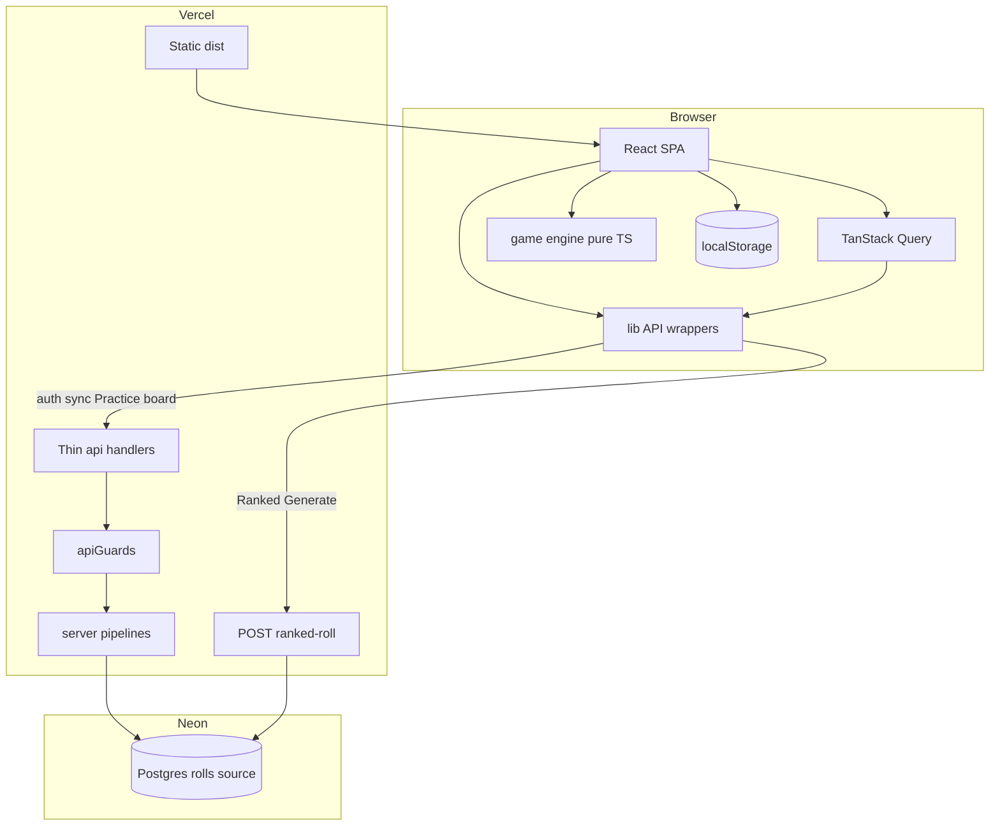
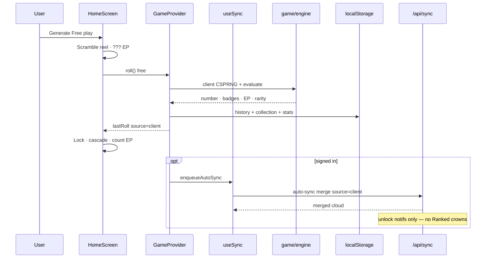
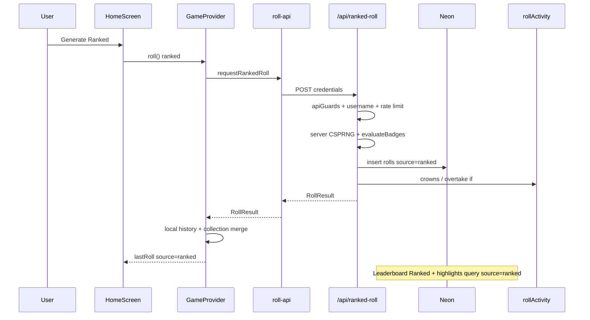
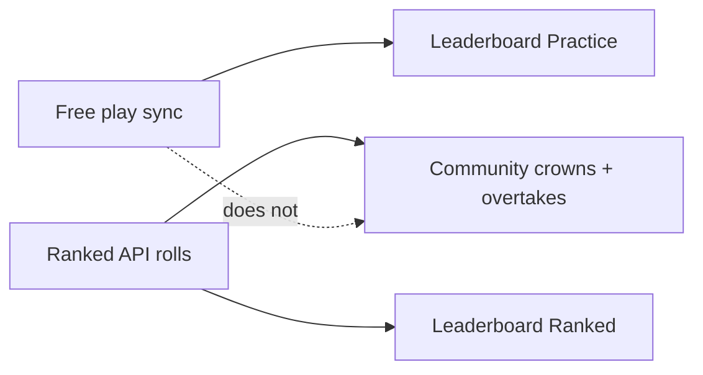
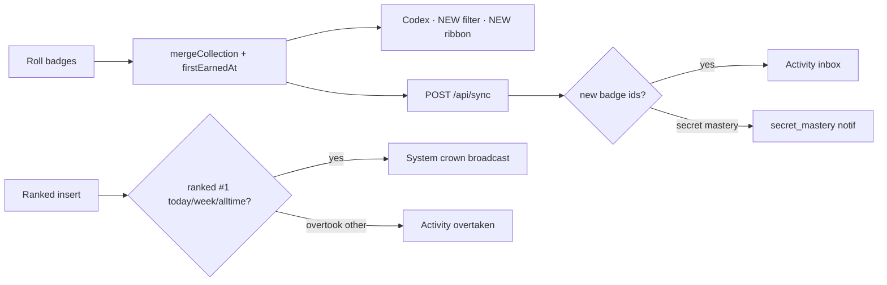
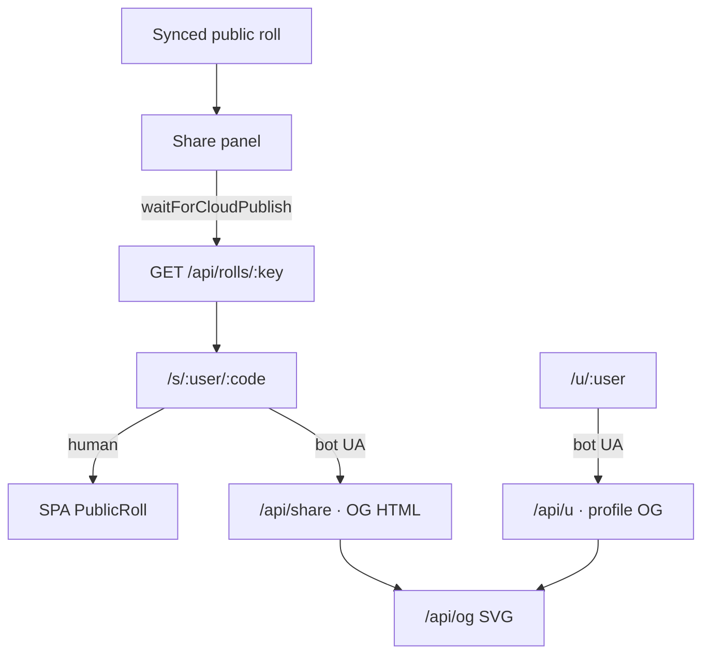

# Architecture

RNGdle Unlocked is a **client-first** number game with an **optional** cloud social layer and a **server-issued Ranked** free-play path for fair competition.

July 2026 readability refactor summary: [`refactor-notes-2026-07.md`](./refactor-notes-2026-07.md).

## High-level

## Roll modes

| Mode               | RNG                | Persist                                           | Competitive surfaces                                  |
| ------------------ | ------------------ | ------------------------------------------------- | ----------------------------------------------------- |
| **Free play**      | Browser CSPRNG     | localStorage → sync as `source=client`            | **Leaderboard → Practice** only                       |
| **Ranked**         | Server CSPRNG      | Neon `source=ranked` first; client merges history | **Leaderboard → Ranked**, community crowns, overtakes |
| **Daily / Weekly** | Deterministic seed | sync as `source=challenge`                        | Optional challenge; not Ranked crowns                 |

Mode switch fully resets the home reel / session roll (and abandons in-flight Generate).

## Free play lifecycle

## Ranked free play lifecycle

## Client data layer

- **Mandatory `src/lib/*-api.ts` wrappers** — UI must not call `fetch('/api/...')` directly (PNG `dataUrl` blob fetches are fine).
- **TanStack Query** (`QueryClientProvider` in `src/main.tsx`) caches leaderboard, feed, highlights, profile, and admin-check reads. Some screens still use effects + wrappers (notifications, account).
- **Zod** validates save import payloads, cloud sync POST bodies, and public profile GET responses — not every endpoint.

## Server handler pattern

- Thin `api/*` entrypoints use `defineHandler` + [`server/apiGuards.ts`](../server/apiGuards.ts) (`requireUser` / `readJson` / `rateGuard`).
- **Read pipelines** live in `server/{leaderboard,profile,feed,ogSvg,notifications}.ts`.
- Some write handlers (`follow`, `me`, `attest`, sync orchestration) still keep more logic inline — prefer extracting when touching them.
- **`tsconfig.server.json`** uses **NodeNext** / **nodenext** so extensionless relative imports fail `pnpm typecheck` before deploy.

## Leaderboards

- **Practice all-time** — `user_progress` lifetime EP / rolls / badge counts (synced free play).
- **Practice week** — public rolls with `source != ranked`.
- **Ranked all-time / week** — sum of public `source=ranked` rolls only.
- Client sync **cannot** set `source=ranked` (server preserves ranked on conflict).
- Sync **rejects** payloads that claim another user’s roll ids or inflate EP/collection without matching rolls (`SyncIntegrityError` → 409).
- Public profiles expose progress provenance pills (`cloud_sync` / `cloned_local` / `local_progress`) from best-roll ownership.

## Badge unlock & notifications

## Share & OG

## Key directories

| Path              | Responsibility                                                                 |
| ----------------- | ------------------------------------------------------------------------------ |
| `src/game/`       | Pure rules: RNG, badges, rarity, secrets, challenges, share text               |
| `src/state/`      | `GameProvider` contexts, `useSync`, settings reducer, localStorage             |
| `src/lib/`        | `*-api.ts` wrappers, `schemas.ts`, auth client, routes, themes                 |
| `src/ui/`         | Screens & motion (reel, cascade, codex, dual boards)                           |
| `api/`            | Thin Vercel route entrypoints                                                  |
| `server/`         | `apiGuards`, auth, DB, merge, ranked issue, read pipelines, rate limits, OG    |
| `public/`         | Icons, avatars, secret art, Absolute Ceiling badge, PWA                        |

## Trust model (honest)

| Claim                       | Reality                                                                               |
| --------------------------- | ------------------------------------------------------------------------------------- |
| Free-play randomness        | Browser CSPRNG + entropy pool — **client-authoritative**; Practice board honor system |
| Ranked free-play randomness | **Server CSPRNG** via `/api/ranked-roll`; scores server-side; `source=ranked`         |
| Challenge numbers           | Deterministic from period seed + subject id                                           |
| Attestation seal            | Server HMAC on a **claim** — not proof of honest client RNG                           |
| Leaderboard Ranked          | Fair competition baseline (server-issued only)                                        |
| Leaderboard Practice        | Who **synced** free-play progress with a username                                     |
| Community crowns            | Ranked rolls only                                                                     |
| Share links                 | Only after roll row exists in Neon                                                    |
| Runtime schema validation   | Zod at **import / sync / profile** boundaries only — not blanket on every API         |

## Related docs

- [Refactor notes (July 2026)](./refactor-notes-2026-07.md)
- [Opus audit + §H implementation status](./opus-report.md)
- [Solo design](./superpowers/specs/2026-07-08-rngdle-unlocked-design.md) _(historical)_
- [Social design](./superpowers/specs/2026-07-09-mvp-part2-social-design.md) _(historical)_
- [Feature wave plan](./superpowers/plans/2026-07-09-feature-wave.md) _(historical)_
