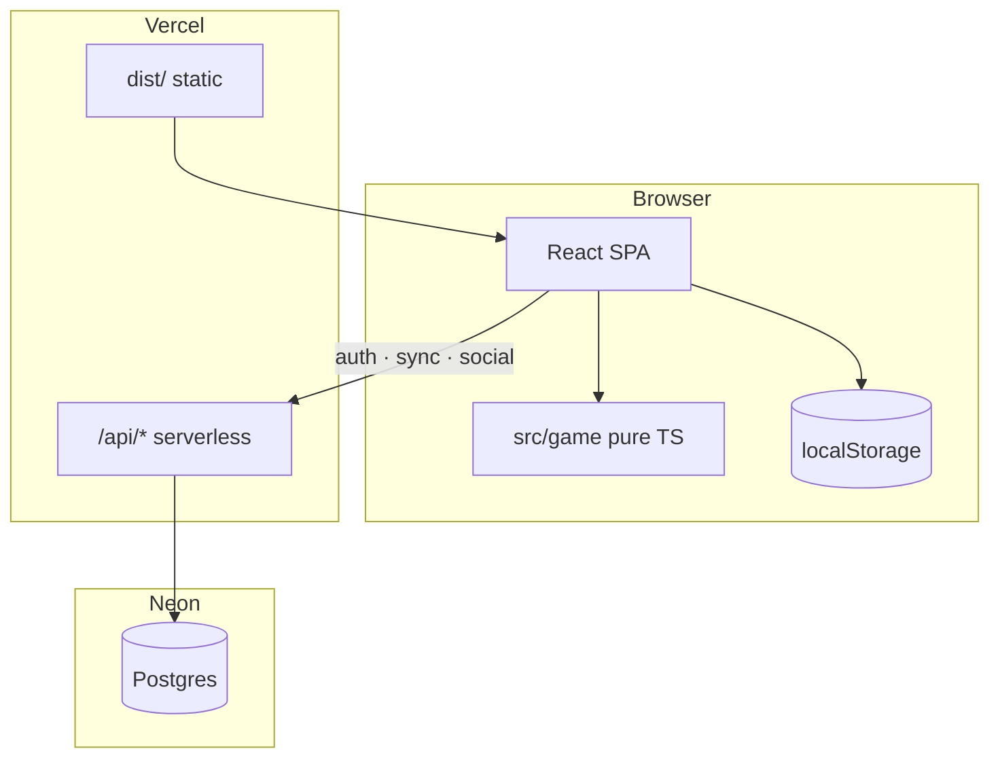
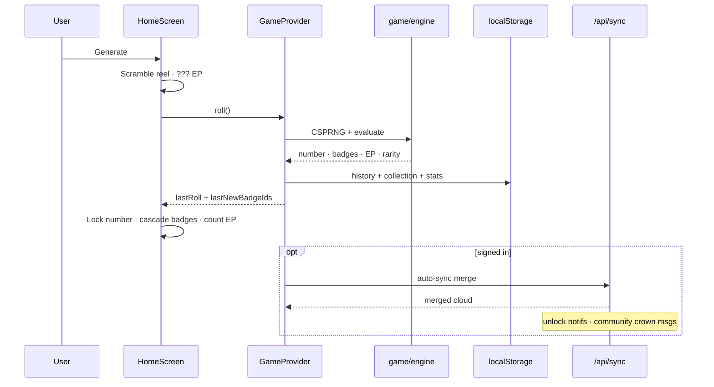
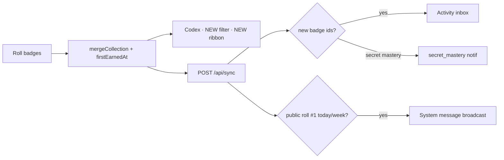
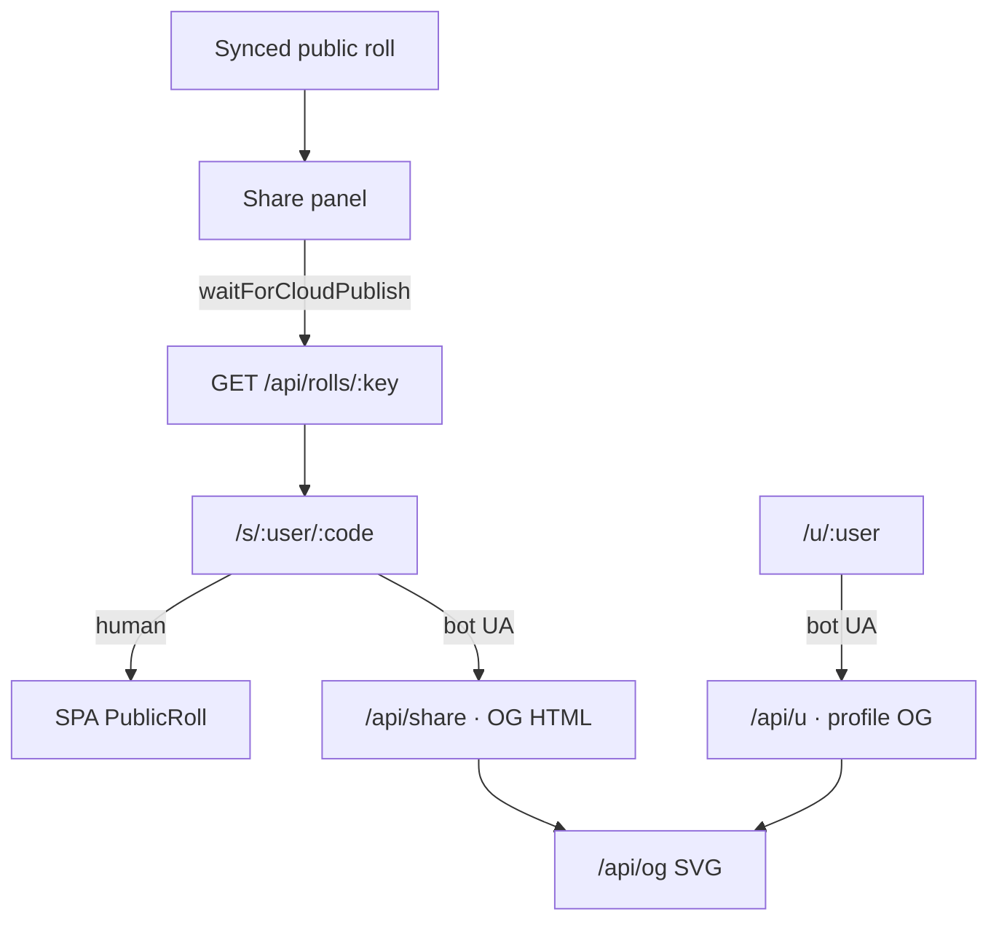

# Architecture

RNGdle Unlocked is a **client-first** number game with an **optional** cloud social layer.

## High-level

## Roll lifecycle (free play)

## Badge unlock & notifications

## Share & OG

## Key directories

| Path | Responsibility |
| --- | --- |
| `src/game/` | Pure rules: RNG, badges, rarity, secrets, challenges, share text |
| `src/state/` | Persistence, roll orchestration, auto-sync |
| `src/ui/` | Screens & motion (reel, cascade, codex) |
| `api/` | Vercel route entrypoints |
| `server/` | Auth, DB, merge, rate limits, roll activity, OG HTML |
| `public/` | Icons, avatars, secret art, PWA |

## Trust model (honest)

| Claim | Reality |
| --- | --- |
| Free-play randomness | Browser CSPRNG + entropy pool — **client-authoritative** |
| Challenge numbers | Deterministic from period seed + subject id |
| Attestation seal | Server HMAC on a **claim** — not proof of honest RNG |
| Leaderboard | Who **synced** with a username — not lottery proof |
| Share links | Only after roll row exists in Neon |

## Related docs

- [Solo design](./superpowers/specs/2026-07-08-rngdle-unlocked-design.md)
- [Social design](./superpowers/specs/2026-07-09-mvp-part2-social-design.md)
- [Feature wave plan](./superpowers/plans/2026-07-09-feature-wave.md)
