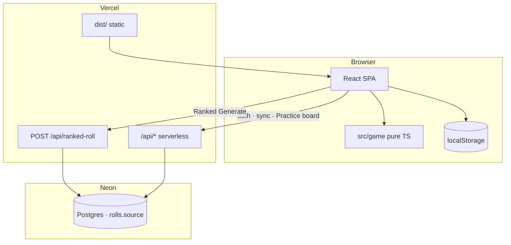
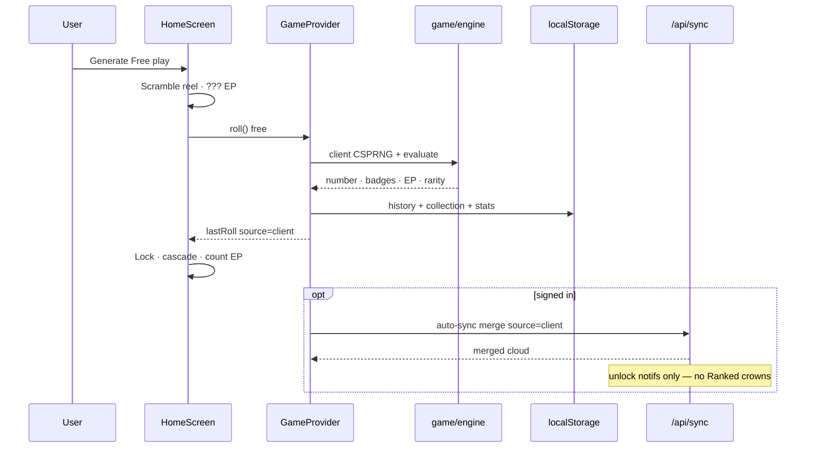
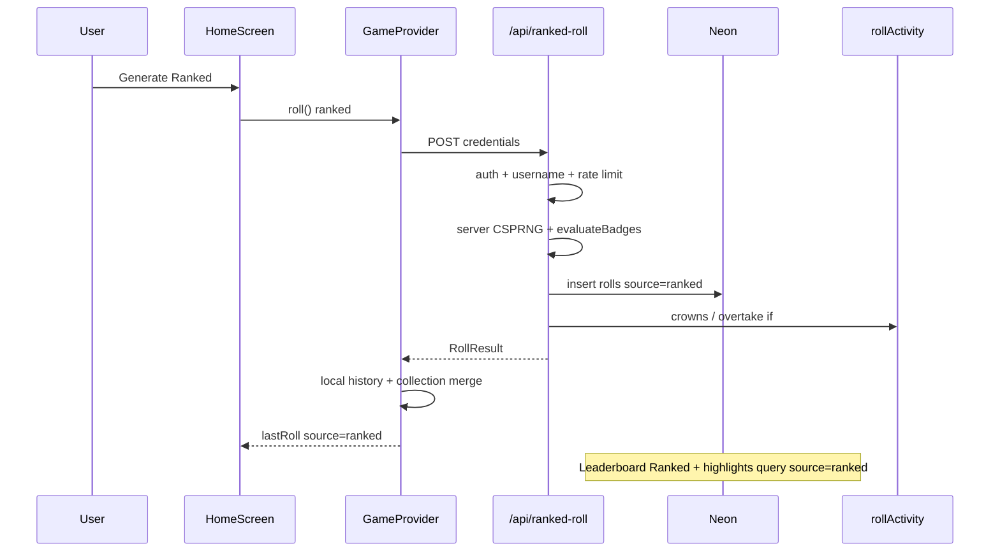
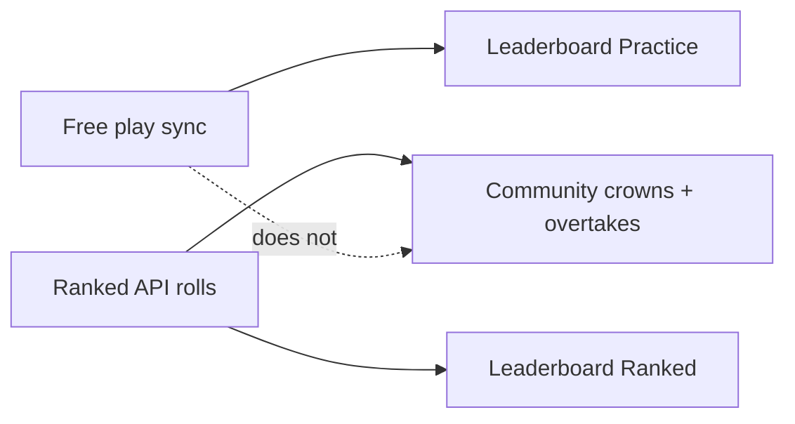
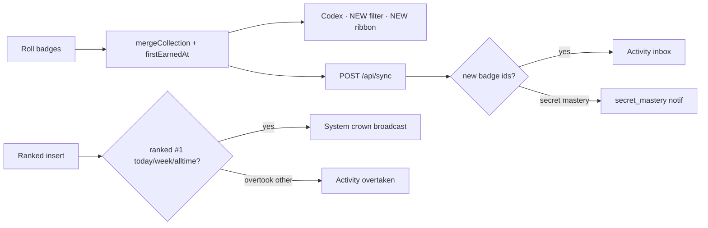
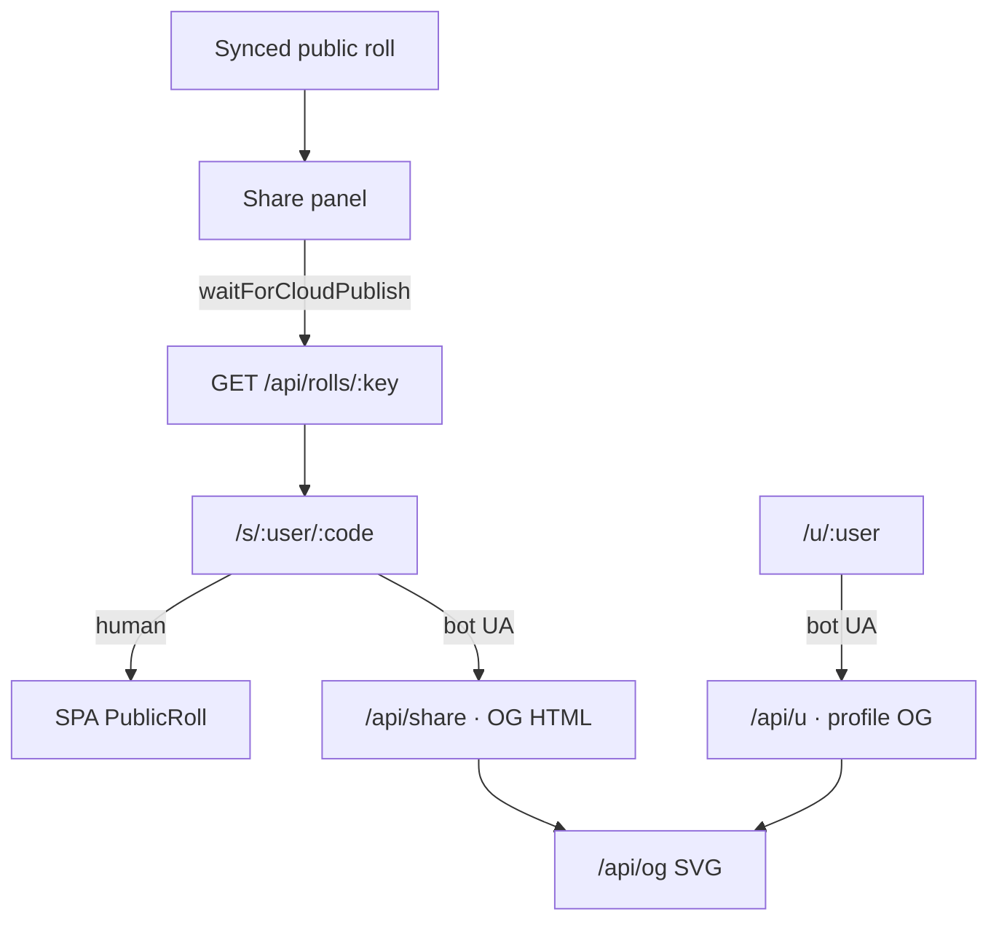

# Architecture

RNGdle Unlocked is a **client-first** number game with an **optional** cloud social layer and a **server-issued Ranked** free-play path for fair competition.

## High-level

## Roll modes

| Mode | RNG | Persist | Competitive surfaces |
| --- | --- | --- | --- |
| **Free play** | Browser CSPRNG | localStorage → sync as `source=client` | **Leaderboard → Practice** only |
| **Ranked** | Server CSPRNG | Neon `source=ranked` first; client merges history | **Leaderboard → Ranked**, community crowns, overtakes |
| **Daily / Weekly** | Deterministic seed | sync as `source=challenge` | Optional challenge; not Ranked crowns |

Mode switch fully resets the home reel / session roll (and abandons in-flight Generate).

## Free play lifecycle

## Ranked free play lifecycle

## Leaderboards

- **Practice all-time** — `user_progress` lifetime EP / rolls / badge counts (synced free play).
- **Practice week** — public rolls with `source != ranked`.
- **Ranked all-time / week** — sum of public `source=ranked` rolls only.
- Client sync **cannot** set `source=ranked` (server preserves ranked on conflict).

## Badge unlock & notifications

## Share & OG

## Key directories

| Path | Responsibility |
| --- | --- |
| `src/game/` | Pure rules: RNG, badges, rarity, secrets, challenges, share text |
| `src/state/` | Persistence, Free / Ranked / challenge orchestration, auto-sync |
| `src/ui/` | Screens & motion (reel, cascade, codex, dual boards) |
| `api/` | Vercel route entrypoints (`ranked-roll`, `leaderboard`, …) |
| `server/` | Auth, DB, merge, ranked issue, rate limits, roll activity, OG HTML |
| `public/` | Icons, avatars, secret art, Absolute Ceiling badge, PWA |

## Trust model (honest)

| Claim | Reality |
| --- | --- |
| Free-play randomness | Browser CSPRNG + entropy pool — **client-authoritative**; Practice board honor system |
| Ranked free-play randomness | **Server CSPRNG** via `/api/ranked-roll`; scores server-side; `source=ranked` |
| Challenge numbers | Deterministic from period seed + subject id |
| Attestation seal | Server HMAC on a **claim** — not proof of honest client RNG |
| Leaderboard Ranked | Fair competition baseline (server-issued only) |
| Leaderboard Practice | Who **synced** free-play progress with a username |
| Community crowns | Ranked rolls only |
| Share links | Only after roll row exists in Neon |

## Related docs

- [Solo design](./superpowers/specs/2026-07-08-rngdle-unlocked-design.md)
- [Social design](./superpowers/specs/2026-07-09-mvp-part2-social-design.md)
- [Feature wave plan](./superpowers/plans/2026-07-09-feature-wave.md)
