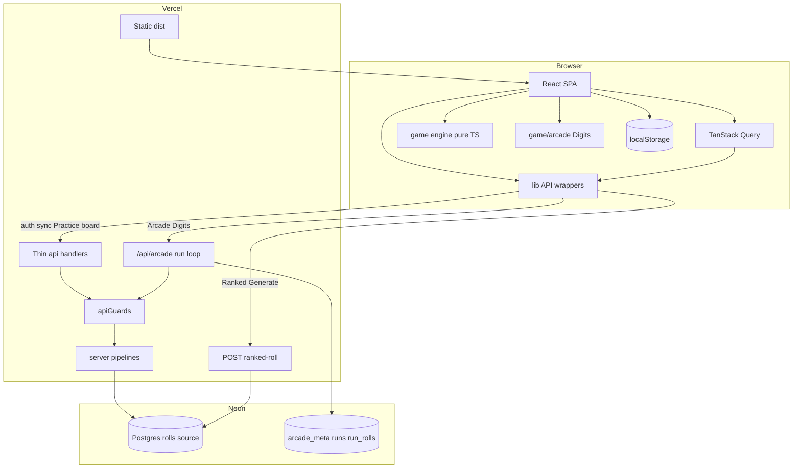
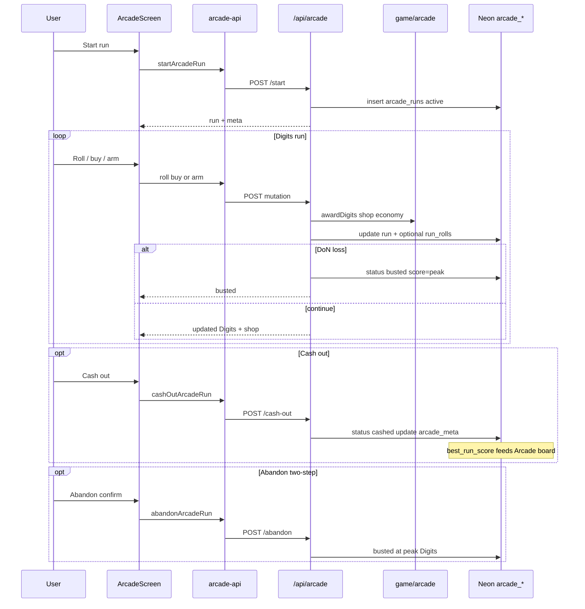
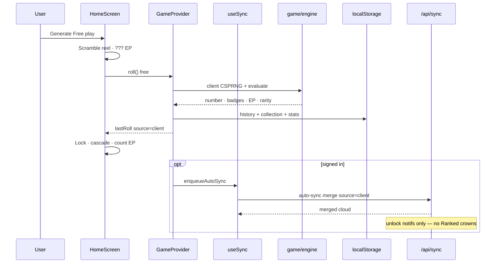
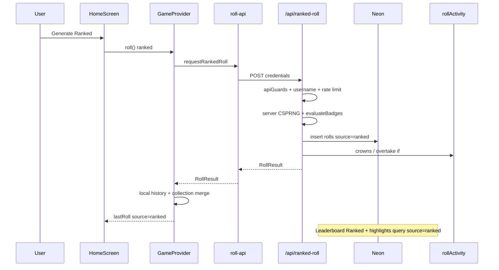
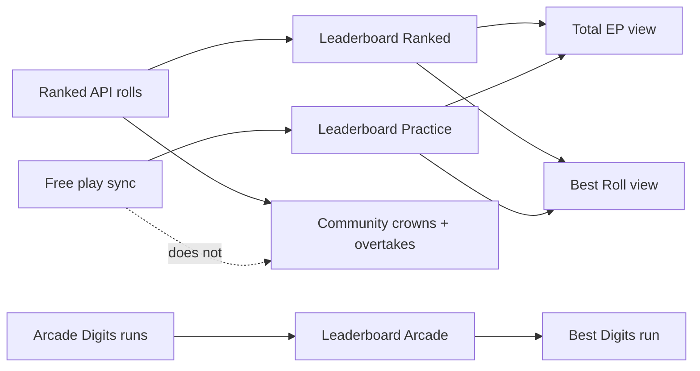
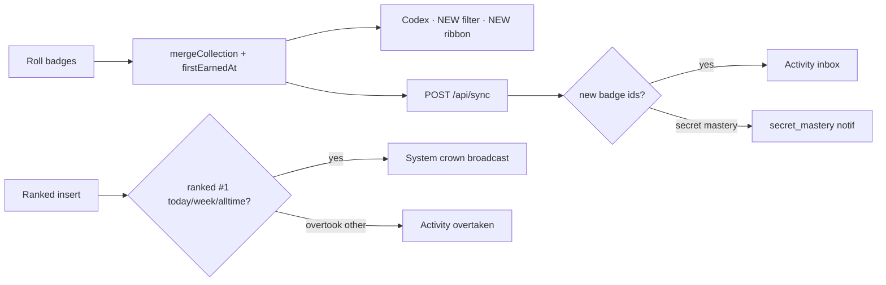
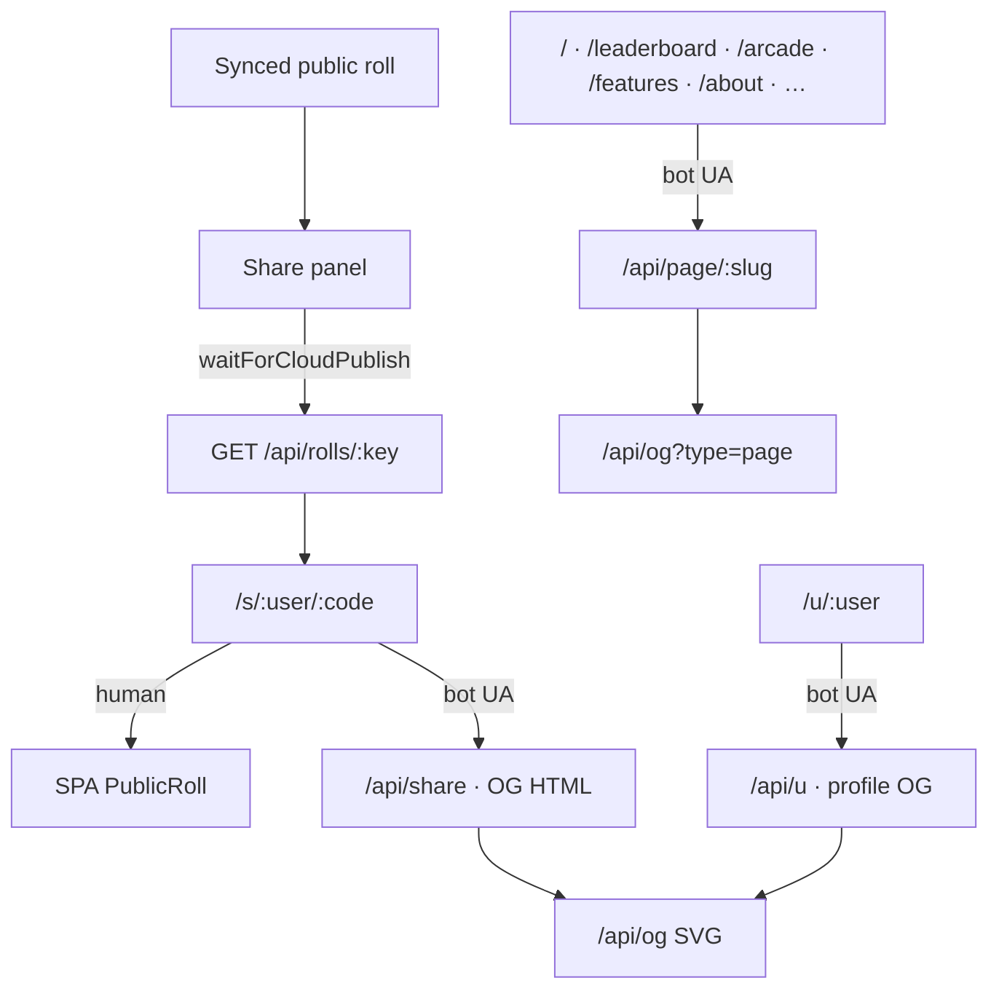

# Architecture

RNGdle Unlocked is a **client-first** number game with an **optional** cloud social layer, a **server-issued Ranked** free-play path for fair competition, and an additive **Arcade Mode** Digits run layer (never EP).

July 2026 readability refactor summary: [`refactor-notes-2026-07.md`](./refactor-notes-2026-07.md). Arcade design: [`superpowers/specs/2026-07-09-arcade-mode-design.md`](./superpowers/specs/2026-07-09-arcade-mode-design.md).

## High-level

## Roll modes

| Mode               | RNG                | Persist                                           | Competitive surfaces                                    |
| ------------------ | ------------------ | ------------------------------------------------- | ------------------------------------------------------- |
| **Free play**      | Browser CSPRNG     | localStorage → sync as `source=client`            | **Leaderboard → Practice** only                         |
| **Ranked**         | Server CSPRNG      | Neon `source=ranked` first; client merges history | **Leaderboard → Ranked**, community crowns, overtakes   |
| **Daily / Weekly** | Deterministic seed | sync as `source=challenge`                        | Optional challenge; not Ranked crowns                   |
| **Arcade**         | Server CSPRNG      | `arcade_*` tables only (Digits)                   | **Leaderboard → Arcade** (best Digits run); Digits ≠ EP |

Mode switch fully resets the home reel / session roll (and abandons in-flight Generate). Arcade is a **separate `/arcade` screen**, not a Home `RollMode`.

## Arcade Digits lifecycle

Server is source of truth for Digits, shop, bust, and cash-out. Client UI (`ArcadeScreen` + `arcade-api.ts`) only displays and requests mutations — it cannot fabricate run scores.

**Isolation:** Arcade reuses `serverRollNumber` + `evaluateBadges` for flavor (EP shown on the roll card is Arcade-only display). It never inserts into `rolls`, never mutates `user_progress`, and never affects Ranked crowns or Practice EP boards.

**Schema:** `arcade_meta` (unlocked upgrades, best Digits, lifetime cashed) · `arcade_runs` (one active run per user) · `arcade_run_rolls` (audit trail). Migration: `scripts/migrate-arcade.mjs`.

## Free play lifecycle

## Ranked free play lifecycle

## Client data layer

- **Mandatory `src/lib/*-api.ts` wrappers** — UI must not call `fetch('/api/...')` directly (PNG `dataUrl` blob fetches are fine).
- **TanStack Query** (`QueryClientProvider` in `src/main.tsx`) caches leaderboard, arcade state/leaderboard, feed, highlights, profile, and admin-check reads. Some screens still use effects + wrappers (notifications, account).
- **Zod** validates save import payloads, cloud sync POST bodies, public profile GET responses, best-roll / feature-request / arcade API payloads — not every endpoint.
- **TanStack Query** also caches feature-request list reads; upvote uses optimistic `useMutation`.

## Server handler pattern

- Thin `api/*` entrypoints use `defineHandler` + [`server/apiGuards.ts`](../server/apiGuards.ts) (`requireUser` / `readJson` / `rateGuard`).
- **Read pipelines** live in `server/{leaderboard,arcadeLeaderboard,profile,feed,ogSvg,notifications,featureRequests,arcade}.ts`.
- Some write handlers (`follow`, `me`, `attest`, sync orchestration) still keep more logic inline — prefer extracting when touching them.
- **`tsconfig.server.json`** uses **NodeNext** / **nodenext** so extensionless relative imports fail `pnpm typecheck` before deploy.

## Leaderboards

- **UI tabs (v0.7+):** Ranked | Practice | Arcade | Feed | Find (mode-first).
- **Practice all-time (Total EP)** — `user_progress` lifetime EP / rolls / badge counts (synced free play).
- **Arcade** — `arcade_meta.best_run_score` (Digits); never mixes with EP boards.
- **Practice week (Total EP)** — public rolls with `source != ranked`.
- **Ranked all-time / week (Total EP)** — sum of public `source=ranked` rolls only.
- **Best Roll (`?view=best`)** — one personal best per player from public rolls matching scope/period; sort by EP or rarity (`RARITY_ORDER`); earliest `rolled_at` ties. Practice all-time Best Roll uses public practice rolls (not `user_progress`).
- Client sync **cannot** set `source=ranked` (server preserves ranked on conflict).
- Sync **rejects** payloads that claim another user’s roll ids or inflate EP/collection without matching rolls (`SyncIntegrityError` → 409).
- Public profiles expose progress provenance pills (`cloud_sync` / `cloned_local` / `local_progress`) from best-roll ownership.

## Feature requests

Signed-in **Features** tab (`/features`): `feature_requests` + `feature_request_votes` (unique upvote per user). List/submit/vote via `server/featureRequests.ts`; admin status PATCH audits like other admin mutations.

## Badge unlock & notifications

## Share & OG

Static SPA routes use [`server/pageOg.ts`](../server/pageOg.ts) titles/descriptions plus a shared brand SVG (`type=page`). Humans still get the SPA; bots are rewritten in `vercel.json`. Baseline `og:*` / `twitter:*` tags also live in `index.html` for non-rewritten crawlers.

## Key directories

| Path               | Responsibility                                                              |
| ------------------ | --------------------------------------------------------------------------- |
| `src/game/`        | Pure rules: RNG, badges, rarity, secrets, challenges, share text            |
| `src/game/arcade/` | Digits economy, upgrades, shop, meta unlocks (shared with server)           |
| `src/state/`       | `GameProvider` contexts, `useSync`, settings reducer, localStorage          |
| `src/lib/`         | `*-api.ts` wrappers (incl. `arcade-api`), `schemas.ts`, auth, routes        |
| `src/ui/`          | Screens & motion (reel, cascade, codex, boards, `ArcadeScreen`)             |
| `api/`             | Thin Vercel route entrypoints (incl. `api/arcade/*`)                        |
| `server/`          | `apiGuards`, auth, DB, merge, ranked, **arcade**, boards, rate limits, OG   |
| `public/`          | Icons, avatars, secret art, Absolute Ceiling badge, PWA                     |

## Trust model (honest)

| Claim                       | Reality                                                                               |
| --------------------------- | ------------------------------------------------------------------------------------- |
| Free-play randomness        | Browser CSPRNG + entropy pool — **client-authoritative**; Practice board honor system |
| Ranked free-play randomness | **Server CSPRNG** via `/api/ranked-roll`; scores server-side; `source=ranked`         |
| Arcade Digits / run score   | **Server-authoritative** via `/api/arcade/*`; client cannot forge Digits or best run  |
| Challenge numbers           | Deterministic from period seed + subject id                                           |
| Attestation seal            | Server HMAC on a **claim** — not proof of honest client RNG                           |
| Leaderboard Ranked          | Fair competition baseline (server-issued only)                                        |
| Leaderboard Practice        | Who **synced** free-play progress with a username                                     |
| Leaderboard Arcade          | Best Digits run (`arcade_meta.best_run_score`); Digits ≠ EP; no crowns                |
| Community crowns            | Ranked rolls only                                                                     |
| Share links                 | Only after roll row exists in Neon                                                    |
| Runtime schema validation   | Zod at **import / sync / profile / arcade** boundaries — not blanket on every API     |

## Related docs

- [Arcade Mode design](./superpowers/specs/2026-07-09-arcade-mode-design.md)
- [Refactor notes (July 2026)](./refactor-notes-2026-07.md)
- [Opus audit + §H implementation status](./opus-report.md)
- [Solo design](./superpowers/specs/2026-07-08-rngdle-unlocked-design.md) _(historical)_
- [Social design](./superpowers/specs/2026-07-09-mvp-part2-social-design.md) _(historical)_
- [Feature wave plan](./superpowers/plans/2026-07-09-feature-wave.md) _(historical)_
