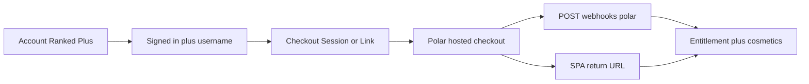

# Polar checkout foundation (design)

Branded Ranked Plus checkout for RNGdle Unlocked. **Not implemented yet** — this doc is the build brief for the next pass. Entitlements / webhooks / public CAD products already ship (see [`polar-monetization.md`](./polar-monetization.md)).

## Goals

- Sell Rare / Epic / Anomaly monthly subs without leaving the product’s visual language.
- Keep Polar as Merchant of Record (tax, receipts, renewals).
- Require signed-in user + public `@username` before checkout.
- Set Polar customer `external_id` = Better Auth `user.id` so webhooks map entitlements.
- Support friend discount codes at checkout (100% forever codes exist; never list them in git).

## Hosted Polar Checkout vs embedded

**Prefer Polar Checkout Sessions / Checkout Links** (hosted) wrapped with our brand chrome before redirect and on return.

| Approach                 | Use                                                                                      |
| ------------------------ | ---------------------------------------------------------------------------------------- |
| Checkout Links           | Fast P1: static/public product links + success/cancel URLs back to SPA                   |
| Checkout Sessions API    | P2: create session server-side with `external_id`, optional `discount_code`, return URLs |
| Fully embedded card form | Avoid for MoR compliance unless Polar’s embedded product is explicitly chosen later      |

Do not invent a custom card capture path.

## In-app surfaces

1. **Account → Ranked Plus** — product cards + current tier + “Manage / Upgrade”.
2. **Home Ranked quota pill** — when at free cap, soft CTA to upgrade.
3. **Deep links** — `/account?upgrade=rare|epic|anomaly` opens the relevant card / starts checkout.
4. **Locked cosmetics** — Account avatar/frame popovers already link to [`/payments`](https://rngdle-unlocked.chron0.tech/payments); later swap to upgrade deep links.

## Brand shell

- Fonts: Outfit (UI), Syne (display), JetBrains Mono (numbers).
- Tokens: `--bg`, `--prose`, `--accent`, `--rare` / `--epic` / `--anomaly`, surface/outline.
- Dark app chrome around any Polar redirect interstitial (“Continuing to secure checkout…”).
- Avoid a generic Polar-only marketing page as the only touchpoint — our cards + copy first.

## Product cards (copy)

| Tier    | Rolls/h | CAD/mo   | Cosmetics                                     |
| ------- | ------- | -------- | --------------------------------------------- |
| Rare    | 120     | CA$4.99  | Rare rim + 4 emblems                          |
| Epic    | 150     | CA$9.99  | Epic rim + 8 emblems (includes Rare)          |
| Anomaly | 180     | CA$14.99 | Anomaly rim + 12 emblems (includes Rare+Epic) |

Note on Rare+: Discord bot gate is **later**, not a checkout blocker.

Optional discount field: “Friend code” → Polar `discount_code`.

## Checkout flow

1. Gate: session + `@username`.
2. Create Checkout Link/Session with product + `external_id`.
3. Redirect to Polar; apply discount code if provided.
4. Success URL → SPA waits briefly for webhook entitlement (poll `GET /api/me` `rankedTier` or quota).
5. Toast + unlock frames/avatars; optional auto-apply tier frame when previous was `none`.

## Customization knobs

- Polar org branding (logo / accent) if available in dashboard.
- Success / cancel URLs to our SPA (`/account?checkout=success|cancel`).
- Product names/descriptions already on Polar; in-app marketing copy owned by us.
- Legal: link `/payments` + Terms before pay.

## Legal / trust

- Player disclosure: `/payments`.
- Terms / Privacy Polar MoR sections already present.
- Top-ups (later): Overload **no rollover** — current UTC hour only; purchase UX must show remaining hour.

## Phased build

| Phase  | Deliverable                                                       |
| ------ | ----------------------------------------------------------------- |
| **P1** | Checkout Links + return URL + Account “Ranked Plus” stub cards    |
| **P2** | API checkout sessions + in-app product picker + friend code field |
| **P3** | Hour-scoped top-ups (refill / Overload) with non-rollover UX      |

README roadmap: “Polar checkout UI” stays **Later**, pointing here.
