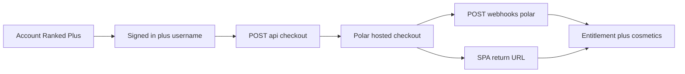

# Polar checkout foundation

Branded Ranked Plus checkout for RNGdle Unlocked. **P2 implemented** — Checkout Sessions API + Account Ranked Plus picker + friend code. Entitlements / webhooks / public CAD products ship alongside (see [`polar-monetization.md`](./polar-monetization.md)). **P3** hour-scoped top-ups remain Later.

## Goals

- Sell Rare / Epic / Anomaly monthly subs without leaving the product’s visual language.
- Keep Polar as Merchant of Record (tax, receipts, renewals).
- Require signed-in user + public `@username` before checkout.
- Set Polar customer `external_id` = Better Auth `user.id` so webhooks map entitlements.
- Support friend discount codes at checkout (100% forever codes exist; never list them in git).

## Hosted Polar Checkout vs embedded

**Prefer Polar Checkout Sessions** (hosted) wrapped with our brand chrome before redirect and on return. Checkout Links are not the primary path.

| Approach                 | Status                                                                              |
| ------------------------ | ----------------------------------------------------------------------------------- |
| Checkout Links           | Skipped as primary (P1) — Sessions cover `external_id` + discount mapping           |
| Checkout Sessions API    | **Shipped (P2)** — `POST /api/checkout` → Polar URL                                 |
| Fully embedded card form | Avoid for MoR compliance unless Polar’s embedded product is explicitly chosen later |

Do not invent a custom card capture path.

## In-app surfaces

1. **Account → Ranked Plus** — product cards + current tier + Subscribe/Upgrade + Manage billing (portal when Polar-linked).
2. **Home Ranked quota pill** — when remaining is `0`, soft “Upgrade” CTA to `/account?upgrade=…`.
3. **Deep links** — `/account?upgrade=rare|epic|anomaly` highlights the card; `?checkout=success|cancel` for return.
4. **Locked cosmetics** — Account avatar/frame popovers link to `/account?upgrade={minTier}` (Payments remains for legal).

## Brand shell

- Fonts: Outfit (UI), Syne (display), JetBrains Mono (numbers).
- Tokens: `--bg`, `--prose`, `--accent`, `--rare` / `--epic` / `--anomaly`, surface/outline.
- Dark app chrome around any Polar redirect interstitial (“Continuing to secure checkout…”).
- Avoid a generic Polar-only marketing page as the only touchpoint — our cards + copy first.

## Product cards (copy)

| Tier    | Rolls/h | CAD/mo   | Cosmetics                                       |
| ------- | ------- | -------- | ----------------------------------------------- |
| Rare    | 120     | CA$4.99  | Rare frame + 4 emblems                          |
| Epic    | 150     | CA$9.99  | Epic frame + 8 emblems (includes Rare)          |
| Anomaly | 180     | CA$14.99 | Anomaly frame + 12 emblems (includes Rare+Epic) |

Note on Rare+: Discord bot gate is **later**, not a checkout blocker.

Optional discount field: “Friend code” → passed as `discountCode` on session create (`allowDiscountCodes` also on Polar page).

## Checkout flow

1. Gate: session + `@username`.
2. `POST /api/checkout` with `{ tier, discountCode? }` → Polar Checkout Session (`externalCustomerId` = user id).
3. Redirect to Polar; apply discount code if provided.
4. Success URL → SPA polls `GET /api/me` until `rankedTier` upgrades (~15s).
5. Toast + unlock frames/avatars; optional auto-apply tier frame when previous was `none`.
6. Manage: `POST /api/checkout/portal` → Polar customer portal (requires linked Polar customer).

### API paths

| Endpoint                    | Role                                                    |
| --------------------------- | ------------------------------------------------------- |
| `POST /api/checkout`        | Create Checkout Session → `{ url }`                     |
| `POST /api/checkout/portal` | Customer portal session → `{ url }`                     |
| Client                      | [`src/lib/checkout-api.ts`](../src/lib/checkout-api.ts) |

Server helpers: [`server/polar/client.ts`](../server/polar/client.ts), [`products.ts`](../server/polar/products.ts), [`checkout.ts`](../server/polar/checkout.ts).

## Customization knobs

- Polar org branding (logo / accent) if available in dashboard.
- Success / cancel URLs to our SPA (`/account?checkout=success|cancel`).
- Product names/descriptions already on Polar; in-app marketing copy owned by us.
- Legal: link `/payments` + Terms before pay (`/payments` stays MoR disclosure, not a buy page).

## Legal / trust

- Player disclosure: `/payments`.
- Terms / Privacy Polar MoR sections already present.
- Top-ups (later): Overload **no rollover** — current UTC hour only; purchase UX must show remaining hour.

## Phased build

| Phase  | Deliverable                                                       | Status      |
| ------ | ----------------------------------------------------------------- | ----------- |
| **P1** | Checkout Links + return URL + Account “Ranked Plus” stub cards    | Skipped     |
| **P2** | API checkout sessions + in-app product picker + friend code field | **Shipped** |
| **P3** | Hour-scoped top-ups (refill / Overload) with non-rollover UX      | Later       |

README roadmap: Account Ranked Plus / Polar checkout Sessions are shipped; top-ups stay Later.
