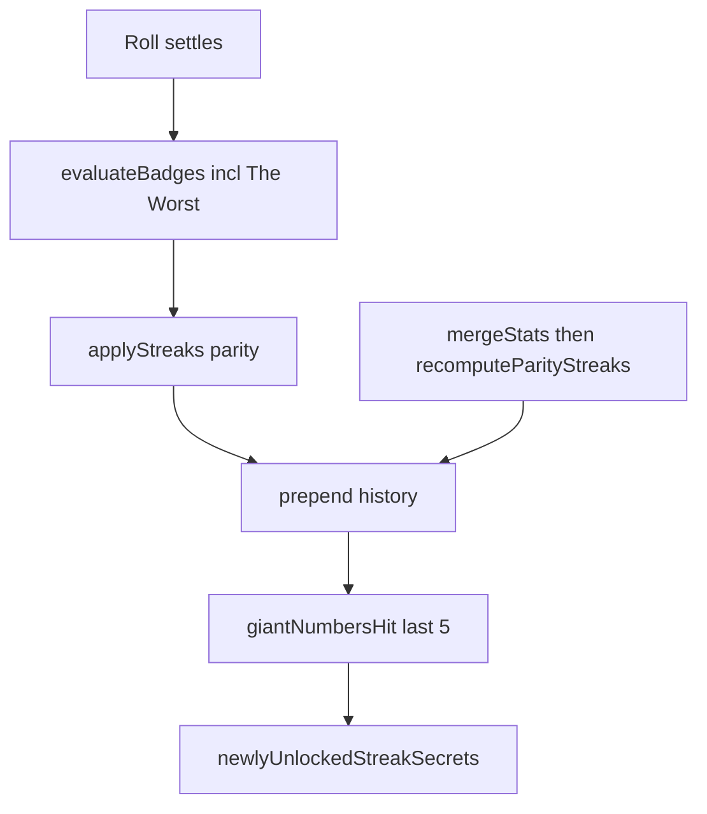

# Workstream H — Cheap Wins Implementation Plan

> **For agentic workers:** REQUIRED SUB-SKILL: Use superpowers:subagent-driven-development (recommended) or superpowers:executing-plans to implement this plan task-by-task. Steps use checkbox (`- [ ]`) syntax for tracking.

**Goal:** Ship The Worst, odd/even streak secrets (5/10), and Giant Numbers with sync that cannot inflate parity streaks via `Math.max`.

**Architecture:** The Worst is a normal cultural number badge (G-style single-roll). Odd/Even and Giant Numbers are `family: 'secret'` meta unlocks evaluated from `PlayStats` / history in `GameProvider` (matchers only see `n`). Parity current streaks are recomputed from merged history after sync/import; bests take `max(stored, recomputed)`.

**Tech Stack:** Pure TS engine (`src/game/`), React state (`GameProvider` / `useSync`), Vitest, existing secret/collection patterns.

**Defaults locked:**

- Lucky Burst: **cut**
- Been There / Seen That / Ascended / Withered: **defer**
- Giant Numbers: sum of **`number`** over **most recent 5 rolls** > `4_000_000`
- The Worst target: other-badges EP === **1758** (one-directional dependency — see Task 1; **full-range fixture required**, not spot-check trust)
- Streak secrets do **not** gate omega / section masteries (`tier: 'streak'`, not in `idsForSection`)
- Art: temporary shared image `/secrets/void.jpg` until dedicated art — tracked under **Art debt** below
- Sync: `mergeStats` never `Math.max`es current parity; client **must** recompute in the **same** apply/persist pass (no “stay 0 until next roll”)

Also save a copy under [`docs/superpowers/plans/2026-07-10-workstream-h-cheap-wins.md`](docs/superpowers/plans/2026-07-10-workstream-h-cheap-wins.md) when implementing (writing-plans convention).

### Review notes (locked in)

- **The Worst EP “circularity”:** Not circular. `sumMatchingEPExcluding` sums every other matching badge; The Worst’s own EP is never in that sum. Displayed roll EP = `1758 + 2200` when it fires — intentional joke.
- **Sync anti-cheat:** Recompute-from-history for current odd/even is the load-bearing design; same principle that made Ascended/Withered day-boundary concerns worth deferring.
- **Omega:** Bases auto-expand omega; streak secrets must not.

### Art debt (pay down later)

Placeholder / temporary assets outstanding after this PR:

1. Workstream H streak + Giant Numbers secrets → `/secrets/void.jpg` (5 cards share Voidwalker art)
2. Any remaining Divine / rarity placeholders still on the running list from earlier waves
3. Bases family / Radix Crown — already replaced with real art if shipped; drop from debt if confirmed on disk

When dedicated H art lands, swap `image` paths in `streakSecrets.ts` only.

---

## File map

| File                                                                                                                                           | Role                                                                                             |
| ---------------------------------------------------------------------------------------------------------------------------------------------- | ------------------------------------------------------------------------------------------------ |
| `[src/game/badges/catalog.ts](src/game/badges/catalog.ts)`                                                                                     | Add `the-worst`                                                                                  |
| `[src/game/badges/index.ts](src/game/badges/index.ts)` or small helper                                                                         | `sumMatchingEPExcluding(n, id)`                                                                  |
| `[src/game/types.ts](src/game/types.ts)`                                                                                                       | Parity fields on `PlayStats`                                                                     |
| `[src/game/stats.ts](src/game/stats.ts)`                                                                                                       | `applyStreaks` parity + `recomputeParityStreaks` + `giantNumbersHit`                             |
| `[src/game/streakSecrets.ts](src/game/streakSecrets.ts)` (**create**)                                                                          | 5 streak/meta secret defs + unlock evaluators                                                    |
| `[src/game/secrets.ts](src/game/secrets.ts)`                                                                                                   | Extend `tier`; append streak secrets to `SECRET_BADGES` for Codex; keep omega logic section-only |
| `[src/state/GameProvider.tsx](src/state/GameProvider.tsx)`                                                                                     | After streaks/history: unlock streak secrets; recompute parity on import/merge paths             |
| `[server/sync.ts](server/sync.ts)`                                                                                                             | `mergeStats`: max **bests** only; set current odd/even to `0` (client recomputes)                |
| `[src/state/useSync.ts](src/state/useSync.ts)` / import in storage                                                                             | After merge: `recomputeParityStreaks(history)`                                                   |
| `[src/game/badges.test.ts](src/game/badges.test.ts)`, `[stats.test.ts](src/game/stats.test.ts)`, `[secrets.test.ts](src/game/secrets.test.ts)` | Coverage                                                                                         |
| `[CHANGELOG.md](CHANGELOG.md)`                                                                                                                 | Unreleased notes                                                                                 |
| `scripts/dump-section-ids.mts`                                                                                                                 | Regenerate after The Worst (cultural section grows)                                              |



---

### Task 1: The Worst (TDD)

**Files:** [`catalog.ts`](src/game/badges/catalog.ts), helper near evaluate/sum, [`badges.test.ts`](src/game/badges.test.ts)

**EP dependency (not circular):** Matcher uses other badges only. Bases/G badges that fire on a given `n` _do_ change that roll’s other-EP total — that is why a **full-range scan fixture** is mandatory after catalog growth, not a remembered `2624`.

- [ ] **Step 1:** Failing unit tests — helper exclusion; `evaluateBadges` includes `the-worst` without recursion when other-EP === 1758.

- [ ] **Step 2:** Helper:

```ts
export function sumMatchingEPExcluding(n: number, excludeId: string): number {
  return NUMBER_BADGES.filter((b) => b.id !== excludeId && b.matches(n)).reduce(
    (acc, b) => acc + b.ep,
    0,
  );
}
```

- [ ] **Step 3:** Catalog entry (cultural, EP **2200**, emoji e.g. `💀`):

```ts
matches: (n) => sumMatchingEPExcluding(n, 'the-worst') === 1758;
```

Description: other badges sum to exactly 1,758 EP. No equation. Displayed roll EP becomes `1758 + 2200` when it fires — intentional.

- [ ] **Step 4:** **Full-range fixture** (0…`ROLL_MAX` inclusive) that:
  1. Collects every `n` where `sumMatchingEPExcluding(n, 'the-worst') === 1758`
  2. Asserts the set is **non-empty**
  3. Asserts every such `n` fires `the-worst` via `evaluateBadges`
  4. Snapshots or asserts known members (expect `2624` if still present; if catalog drift dropped it, update expected set from this scan — do not hardcode the matcher to `2624`)
  5. Asserts at least one near-miss (other-EP ≠ 1758) does **not** fire

  Run via Vitest (may be slow — mark as a dedicated test; keep under ~few seconds if possible by scanning once and caching hits in the test). Prefer `pnpm exec tsx` script only as a one-off; the **checked-in test** is the source of truth.

- [ ] **Step 5:** Regenerate section ids if cultural snapshot is checked in; `pnpm test`.

- [ ] **Step 6:** Commit `feat(badges): add The Worst at 1758 other-EP`

---

### Task 2: Parity PlayStats + recompute

**Files:** `[types.ts](src/game/types.ts)`, `[stats.ts](src/game/stats.ts)`, `[stats.test.ts](src/game/stats.test.ts)`

- [ ] **Step 1:** Extend `PlayStats`:

```ts
oddStreak: number;
bestOddStreak: number;
evenStreak: number;
bestEvenStreak: number;
```

Defaults `0`. Storage already spreads `defaultPlayStats()` over partial JSON — fine.

- [ ] **Step 2:** In `applyStreaks`, after quality streak:

```ts
if (roll.number % 2 === 1) {
  next.oddStreak = stats.oddStreak + 1;
  next.evenStreak = 0;
  next.bestOddStreak = Math.max(stats.bestOddStreak, next.oddStreak);
} else {
  next.evenStreak = stats.evenStreak + 1;
  next.oddStreak = 0;
  next.bestEvenStreak = Math.max(stats.bestEvenStreak, next.evenStreak);
}
```

(`0` is even.)

- [ ] **Step 3:** Add `recomputeParityStreaks(historyNewestFirst)` — reverse to chrono, walk once, return current + best odd/even. Add `giantNumbersHit(historyNewestFirst): boolean` — if `length < 5` false; else sum of first 5 `.number` values `> 4_000_000`.

- [ ] **Step 4:** Tests for parity reset, bests, giant true/false fixtures.

- [ ] **Step 5:** Commit `feat(stats): parity streaks and giant-numbers window`

---

### Task 3: Streak / Giant secret defs + unlock API

**Files:** create `[src/game/streakSecrets.ts](src/game/streakSecrets.ts)`; modify `[secrets.ts](src/game/secrets.ts)`; Collection already iterates `SECRET_BADGES`

| id                      | Name          | EP   | Unlock                     |
| ----------------------- | ------------- | ---- | -------------------------- |
| `secret-streak-odd-5`   | Very Odd      | 1500 | `oddStreak >= 5`           |
| `secret-streak-odd-10`  | Extremely Odd | 3000 | `oddStreak >= 10`          |
| `secret-streak-even-5`  | Uneven        | 1500 | `evenStreak >= 5`          |
| `secret-streak-even-10` | Very Uneven   | 3000 | `evenStreak >= 10`         |
| `secret-giant-numbers`  | Giant Numbers | 2500 | `giantNumbersHit(history)` |

- [ ] **Step 1:** Extend `SecretBadgeDef.tier` to `'section' | 'omega' | 'streak'`. **Lock:** `tier: 'streak'`, `section: 'streak'` (extend section union; **not** in `SECTION_FAMILIES`, so `idsForSection` / omega unchanged). Streak secrets must never appear in omega completion checks.

- [ ] **Step 2:** `STREAK_SECRETS` + `SECRET_BADGES = [...SECTION_SECRETS, ...STREAK_SECRETS, OMEGA_SECRET]`. `evaluateOwnedSecrets` / `newlyUnlockedSecrets` **ignore** streak tier (only section + omega). Test: full collection of all number + journey + section secrets still unlocks omega **without** any streak secret owned.

- [ ] **Step 3:** `newlyUnlockedStreakSecrets(stats, history, unlockedIds)` + `mergeStreakUnlocks(collection, stats, history, at)` mirroring `mergeSecretUnlocks` (add-only collection, return hits + EP).

- [ ] **Step 4:** Collection UI: treat `tier === 'streak'` like section for locked meta copy (no roll spoilers beyond “hit a streak / giant window”). Omega card logic stays `tier === 'omega'`.

- [ ] **Step 5:** Tests; commit `feat(secrets): odd/even streak and Giant Numbers unlocks`

---

### Task 4: GameProvider wiring

**Files:** [`GameProvider.tsx`](src/state/GameProvider.tsx) (~337–370 and import/merge paths ~505), [`useSync.ts`](src/state/useSync.ts), import path in [`storage.ts`](src/state/storage.ts) if import applies stats

- [ ] After `applyStreaks` + `recomputeBestConsecutive`, call `mergeStreakUnlocks` (parity already on `stats`; pass `history`).
- [ ] Fold streak hits into `secretsUnlocked` / `secretsEPGained` / `lifetimeEP` / celebration (same mythic path as section secrets is fine).
- [ ] **Required same-pass recompute** on every cloud apply / import / merge that writes `stats` to React state or localStorage. Extract a small helper used by all paths, e.g. `finalizeStatsFromHistory(stats, history)` that runs `recomputeBestConsecutive` + `recomputeParityStreaks` and returns the patched `PlayStats` **before** `setState` / `persist`. **Do not** ship a window where `oddStreak`/`evenStreak` are 0 in persisted or UI-visible state after sync while history still implies a non-zero streak.

```ts
const parity = recomputeParityStreaks(history);
stats = {
  ...stats,
  oddStreak: parity.oddStreak,
  evenStreak: parity.evenStreak,
  bestOddStreak: Math.max(stats.bestOddStreak, parity.bestOddStreak),
  bestEvenStreak: Math.max(stats.bestEvenStreak, parity.bestEvenStreak),
};
```

then `mergeStreakUnlocks` so eligible secrets grant after sync.

- [ ] Manual / unit check: after simulated merge with `oddStreak: 0` from `mergeStats` and history of 4 odds, first painted state has `oddStreak === 4` (not 0).

- [ ] Commit `feat(state): unlock streak secrets on roll and recompute after merge`

---

### Task 5: Sync anti-cheat

**Files:** [`server/sync.ts`](server/sync.ts) `mergeStats`

- [ ] For new fields: `bestOddStreak` / `bestEvenStreak` = `Math.max`; **`oddStreak` / `evenStreak` = `0`** in merge result (authoritative recompute is client-side from merged history). Do **not** `Math.max` current parity streaks.
- [ ] Client post-merge **must** run Task 4 `finalizeStatsFromHistory` in the same pass (hard requirement — not “acceptable briefly”).
- [ ] Test: inflated `oddStreak: 99` + short history → after merge+recompute, current matches history length/parity, not 99.
- [ ] Commit `fix(sync): do not Math.max current parity streaks`

---

### Task 6: Docs + verify

- [ ] CHANGELOG Unreleased: The Worst, four parity secrets, Giant Numbers, sync note; list deferred/cut items briefly.
- [ ] README badge/secret counts if they cite totals.
- [ ] Note H art debt in CHANGELOG or a one-line under Unreleased “Art follow-up”.
- [ ] `pnpm typecheck` + `pnpm test` (including full-range The Worst fixture).
- [ ] Manual: The Worst via fixture hits; 5 odds unlock Very Odd; five large numbers unlock Giant Numbers; **sync with in-progress odd streak does not flash 0 in UI**.
- [ ] Commit `docs: Workstream H cheap wins notes`

---

## Out of scope

- Lucky Burst (cut)
- Been There / Seen That, Ascended / Withered
- Dedicated secret art (tracked in Art debt — do not forget)
- Retargeting `qualityStreak` merge to recompute-from-history (optional later)
- Existing badge EP / firing changes
